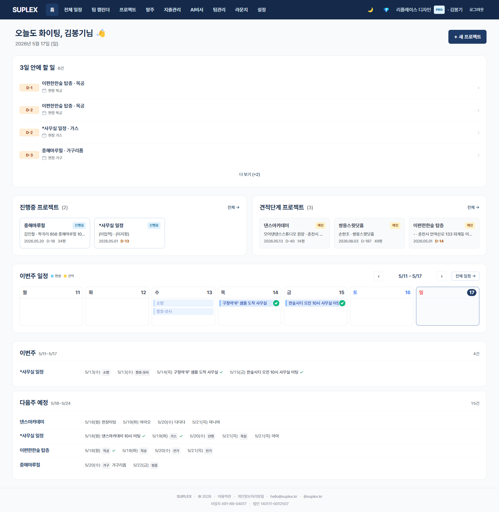

# 챕터 2. 홈 화면

> 이 챕터를 읽고 나면 — 출근 후 5분 안에 오늘 무엇을 해야 할지, 이번 주 어떤 현장이 어떻게 돌아가는지 한눈에 파악할 수 있게 됩니다.

---

## 홈 페이지

> **이 페이지는** 회사 전체의 "오늘·이번 주 무엇을 해야 하나"를 한 화면에 모아 보여주는 곳입니다. 좌측 메뉴 **홈** 클릭 또는 로그인 직후 자동 도착합니다.

### 화면 한눈에

> 📸 `assets/screens/01_home.png` — 영역 ①~⑥ 라벨링 후 저장

| 번호 | 영역 | 설명 |
|---|---|---|
| ① | 인사말 헤더 | 시간대별 인사 + 사용자 이름 + 오늘 날짜 (예: "좋은 아침입니다, 김OO님 👋") |
| ② | **3일 안에 할 일** 카드 | 이 페이지의 가장 중요한 영역. 회사 전체 체크리스트 중 마감일이 향후 3일 안에 있는 항목을 자동 수집해 **역할별로 라우팅** — 현장팀에게는 현장 관련, 디자인팀에게는 디자인 관련만 |
| ③ | 진행 중인 프로젝트 | 시공 단계(IN_PROGRESS) 프로젝트 카드 그리드 (좌) |
| ④ | 견적 단계 프로젝트 | 계약 전(PLANNED) 단계 프로젝트 카드 그리드 (우) |
| ⑤ | 주간 공정 일정 | 이번 주 모든 현장의 공정 작업을 일자별로 모아 표시 |
| ⑥ | 주간 브리프 | 회사 활동 요약 + 라운지 추천 글 |

### 이 페이지에서 할 수 있는 것

- **오늘·내일·모레 할 일 즉시 파악** — ② 카드 한 번 훑으면 80% 끝남
- 진행 카드 클릭 → 해당 프로젝트 상세 페이지로 즉시 이동
- 견적 단계 카드 클릭 → 1차 견적 보강
- 이번 주 어느 현장에 누가 가는지 확인
- 라운지 추천 글 한 줄 훑기

### 이럴 때 옵니다 (시나리오)

- **출근 직후 5분 루틴** — ① 인사 확인 → ② 카드 위에서부터 처리 → 끝
- **퇴근 전 마무리** — ⑤ 주간 일정으로 내일 미리 보기
- **클라이언트 전화 받았을 때** — ③/④ 카드에서 해당 현장 빠르게 찾기
- **다른 업체 동향이 궁금할 때** — ⑥ 라운지 추천 글 클릭

### 인접 페이지로

- → [전체 일정](13-schedule.md) — 이번 주 너머의 큰 그림이 필요할 때
- → [프로젝트 목록](04-projects.md) — 모든 현장의 상태를 카드/표로 보고 싶을 때
- → [라운지](18-lounge.md) — 다른 인테리어 업체들 글 보기

### 자주 묻는 질문

**Q. ② "3일 안에 할 일"은 어떤 기준으로 모이나요?**
A. 회사의 모든 프로젝트 체크리스트 중 마감일이 향후 3일 이내인 항목입니다. AI 추천이 아닌 **결정론적 계산**이라 누락·왜곡이 없습니다. 사용자가 현장팀(FIELD)이면 현장 관련 항목만, 디자인팀(DESIGN)이면 디자인 관련 항목만 자동으로 골라서 보여줍니다 — 본인 일이 아닌 건 다른 사람 화면에 뜹니다.

**Q. ⑤ 주간 공정 일정에 안 나오는 일정이 있어요.**
A. 각 프로젝트의 **공정 일정 탭**에서 등록되지 않은 일정은 집계되지 않습니다. 입력은 챕터 12 일정 관리 참조.

**Q. ④ 견적 단계는 어떻게 진행 중으로 넘어가나요?**
A. 견적이 확정되면 자동으로 IN_PROGRESS로 전이됩니다(계약금액 sync 시점). 챕터 7 변경 관리 참조.

---

[← 챕터 1](02-account-setup.md) · [다음: 챕터 3 — 첫 프로젝트 만들기 →](04-projects.md)
