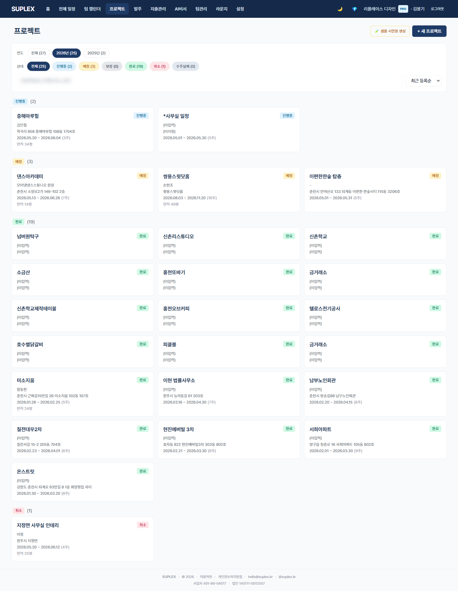
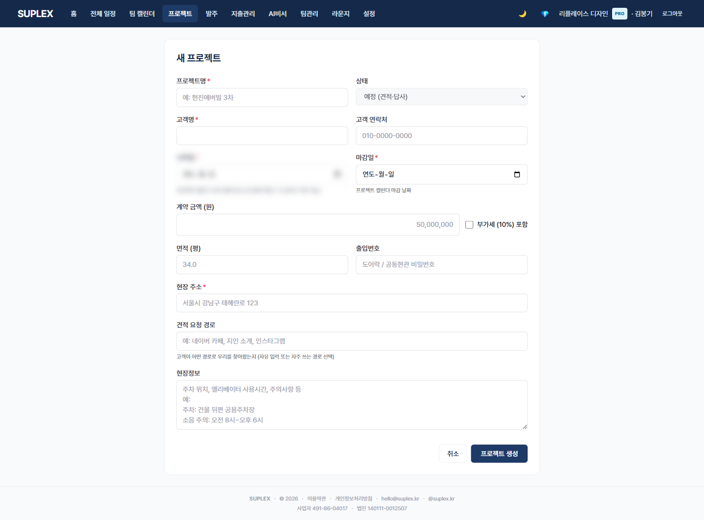

# 챕터 3. 프로젝트

> 이 챕터를 읽고 나면 — 회사의 모든 프로젝트를 카드 그리드로 조망하고, 새 프로젝트를 만들며, 프로젝트 진입 시 13탭 구조와 공통 헤더를 이해할 수 있게 됩니다.

---

## 프로젝트의 세 화면

| 위치 | 단위 | 용도 |
|---|---|---|
| **프로젝트 목록** `/projects` | 회사 전체 | 카드 그리드·필터·검색·시연 샘플 시드 |
| **새 프로젝트** `/projects/new` | 단일 폼 | 신규 생성 (8필드) |
| **프로젝트 헤더 + 13탭** `/projects/:id/...` | 한 프로젝트 | 모든 탭 공통 헤더 + 13탭 네비 |

---

## 3-1. 프로젝트 목록

> **이 페이지는** 회사 모든 프로젝트를 6 상태별 카드로 조망하고 연도·검색·정렬로 좁히는 기능을 가지고 있습니다. 좌측 메뉴 **프로젝트** 클릭.

### 화면 한눈에

> 📸 `assets/screens/03_projects.png` — 영역 ①~⑥ 라벨링 후 저장



| 번호 | 영역 | 설명 |
|---|---|---|
| ① | 페이지 타이틀 + 액션 | "프로젝트" + **+ 새 프로젝트** + 시연 샘플 시드 |
| ② | 연도 필터 | 현재 연도 디폴트, 전체·과거 연도 선택 |
| ③ | 상태 필터 | 6 상태(예정·진행중·보류·완료·취소·**수주실패**) |
| ④ | 검색 + 정렬 | 프로젝트명·고객·주소 검색 / 최신순·이름순·시작일순 |
| ⑤ | 카드 그리드 | 프로젝트명·고객·주소·면적·기간·상태 칩·진행률 |
| ⑥ | 모바일 필터 시트 | 모바일에선 ②③④가 하단 시트로 묶여 노출. 활성 필터 있으면 ● 표시 |

### 6 프로젝트 상태

| 상태 | 색 | 의미 |
|---|---|---|
| PLANNED | 노랑 | 견적 단계, 계약 전 |
| IN_PROGRESS | 하늘 | 시공 진행 중 |
| ON_HOLD | 회색 | 보류 (재개 가능성 있음) |
| COMPLETED | 초록 | 시공 완료 |
| CANCELLED | 빨강 | 도중 취소 |
| LOST | 짙은회색 | 수주 실패 (영업 단계에서 놓침) |

### 이 페이지에서 할 수 있는 것

- 카드 클릭 → 프로젝트 상세 (기본 탭 = 공정 일정)
- + 새 프로젝트 → 폼 페이지
- 연도·상태·검색·정렬 다중 필터
- 시연 샘플 시드 (개발·시연용으로 데이터 풍부한 데모 프로젝트 즉시 생성)

### 이럴 때 옵니다 (시나리오)

- **회사 출근 첫 화면** — 진행중 카드만 필터링해서 오늘 작업할 현장 빠르게 진입
- **분기 매출 조회** — 완료 상태 + 연도 필터로 종결된 프로젝트만
- **영업 깔때기 점검** — PLANNED + LOST 비율로 견적 → 수주 전환율
- **시연 준비** — 시드 샘플 버튼으로 데이터 풍부한 데모 즉시 생성

### 인접 페이지로

- → [홈](03-home.md) — 카드 그리드 대신 "3일 안에 할 일" 중심
- → [새 프로젝트](#3-2-새-프로젝트-만들기)

---

## 3-2. 새 프로젝트 만들기

> **이 페이지는** 프로젝트 1건을 8개 필드로 생성하는 폼 기능을 가지고 있습니다. 프로젝트 목록 → **+ 새 프로젝트**.

### 화면 한눈에

> 📸 `assets/screens/04_projects_new.png` — 영역 ①~③ 라벨링 후 저장



| 번호 | 영역 | 설명 |
|---|---|---|
| ① | 페이지 헤더 | "새 프로젝트" |
| ② | 폼 필드 | 프로젝트명·고객·연락처·주소·면적·시작일·종료일·예상 견적·비고 |
| ③ | 생성·취소 | 생성 → 즉시 프로젝트 상세(공정 일정 탭)로 진입 |

### 입력 필드

| 필드 | 예시 | 필수 |
|---|---|---|
| 프로젝트명 | "강남 래미안 304-1502 리모델링" | ✅ |
| 고객명 | "박OO" | ✅ |
| 연락처 | 010-XXXX-XXXX | 권장 |
| 주소 | 서울 강남구 도곡동 123, 304동 1502호 | ✅ |
| 면적 (평) | 30 | ✅ |
| 시작일 | 2026-05-15 | 권장 |
| 종료일 | 2026-06-26 | 권장 |
| 비고 | 클라이언트 특이사항 | 선택 |

### 생성 시 자동으로 일어나는 일

1. 프로젝트 생성
2. **회사 전직원 자동 합류 (디폴트)** — 회사 멤버 전원이 ProjectMember로 등록. LEAD가 개별 제외 가능
3. 회사 마감재 템플릿 자동 시드
4. 회사 견적 비율(디자인비·부가세 등) 회사 디폴트로 채움
5. 공정 일정 탭으로 자동 진입

> 회사 템플릿이 잘 정리되어 있을수록 새 프로젝트가 빈 화면이 아닌 **30~50% 채워진 상태**로 시작합니다.

### 이럴 때 옵니다 (시나리오)

- **첫 미팅 직후** — 미팅 끝나기 전 모바일로 즉시 생성 → 메모 탭에 미팅 노트 저장
- **견적 의뢰만 받은 단계** — 상태 PLANNED로 두고 1차 견적 작성

### 인접 페이지로

- → [프로젝트 헤더 + 13탭](#3-3-프로젝트-헤더와-13탭) — 생성 직후 자동 진입
- → [메모](12-memo.md) — 미팅 노트 첫 저장
- → [간편 견적](06-simple-quote.md) — 1차 견적 시작

---

## 3-3. 프로젝트 헤더와 13탭

> **이 영역은** 한 프로젝트의 모든 탭에서 공통으로 보이는 헤더(프로젝트 정보 + 햄버거 메뉴 + 13탭 네비)입니다. 프로젝트 진입 시 기본 탭은 **공정 일정**.

### 화면 한눈에

> 📸 헤더 부분은 `assets/screens/12_project_schedule.png` 상단 크롭. 영역 ①~⑤ 라벨링

| 번호 | 영역 | 설명 |
|---|---|---|
| ① | ProjectInfoCard | 프로젝트명·고객·주소·면적·기간·진행률·**활성 견적 합계** |
| ② | 햄버거 메뉴 | 팀(ProjectMembersModal) · 수정(EditProjectModal) · 일정 복사(ExtractModal) |
| ③ | 13탭 네비 (가로 스크롤) | 공정일정·공정현황·간편견적·상세견적·견적상담·마감재·발주·체크리스트·현장보고·메모·지출·정산·**편의기능** |
| ④ | 탭 본문 | 활성 탭 내용 (Outlet) |
| ⑤ | 회사 hideExpenses 토글 효과 | 회사 단위 토글 시 지출·정산 탭 자동 숨김 |

### 프로젝트 13탭 한눈에

| # | 탭 | 경로 | 핵심 | 챕터 |
|---|---|---|---|---|
| 1 | 공정 일정 | `schedule` | 일자별 공정 작업 | 12 |
| 2 | 공정 현황 | `process` | 25 공정 × 4축 통합 뷰 | 12-3 |
| 3 | 간편 견적 | `quotes` | 차수 pill·인라인 표 | 5 |
| 4 | 상세 견적 | `quotes-detail` | 갑지·18행 원가내역서 | 6 |
| 5 | 견적 상담 | `quote-consultations` | 공정별 메모 카드 | 7-2 |
| 6 | 마감재 | `materials` | spaceGroup·인라인 테이블 | 4 |
| 7 | 발주 | `orders` | 4 상태·다중 일괄 처리 | 8 |
| 8 | 체크리스트 | `checklist` | team 자동·카톡 양식 | 9 |
| 9 | 현장보고 | `reports` | 보고·사진 타임라인 | 10 |
| 10 | 메모 | `memo` | 7 태그·카드 | 11 |
| 11 | 지출 | `expenses` | 발주 + 지출 동시 뷰 | 13 |
| 12 | 정산 | `settlement` | 공정별 견적 vs 실지출 | 13-3 |
| 13 | 편의기능 | `tools` | 일정 복사·인건비·안내문 | 19 |

### 이 영역에서 할 수 있는 것

- 어느 탭에 있든 ProjectInfoCard에서 활성 견적 합계 즉시 확인
- 햄버거 메뉴 → 프로젝트 멤버 관리(LEAD 제외 가능) · 정보 수정 · 일정 복사
- 13탭 가로 스크롤로 모바일에서도 모든 탭 접근
- 회사 단위 hideExpenses 켜져 있으면 지출·정산 자동 숨김

### 실무 진입 순서 (추천)

```
[첫 미팅 직후 Day 1]
  메모(10) → 마감재(6) → 간편 견적(3) → 견적 상담(5)

[견적 합의 후 Day 7~14]
  공정 일정(1) → 발주(7) → 체크리스트(8)

[공사 시작 후 매일]
  현장보고(9) → 지출(11) → 편의기능 → 인건비 정산(13)

[변경 발생 시 수시]
  마감재(6) CHANGED → 간편 견적(3) 2차 → 발주(7) ⚠️ 처리

[프로젝트 종료 후]
  정산(12) — 공정별 회고 메모 → 다음 견적 가이드 누적
```

### 인접 페이지로

- → 각 챕터 — 위 표 참조
- → [프로젝트 목록](#3-1-프로젝트-목록) — 헤더의 프로젝트명 또는 뒤로 가기

### 자주 묻는 질문

**Q. 13탭이 너무 많아 어디부터 손대야 할지 모르겠습니다.**
A. 실무 진입 순서 블록 참조. 메모 → 마감재 → 견적 순으로 시작.

**Q. 회사 멤버 전원이 자동 합류한다는데 권한이 모두 같나요?**
A. ProjectMember 합류 + 회사 Membership 역할이 그대로 적용. LEAD가 개별 멤버를 제외 가능.

**Q. 시연 샘플 시드는 실제 데이터에 영향이 있나요?**
A. 별도 시연용 프로젝트로 생성됩니다 (siteCode 식별). 여러 번 만들어도 안전.

---

[← 챕터 2](03-home.md) · [다음: 챕터 4 — 마감재 관리 →](05-materials.md)
