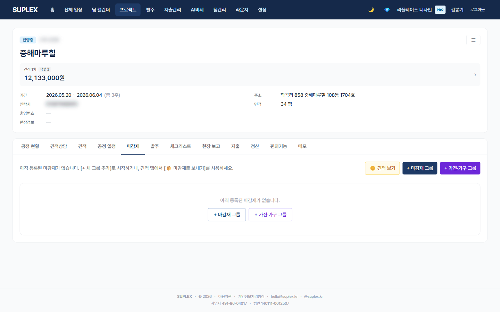

# 챕터 4. 마감재 관리

> 이 챕터를 읽고 나면 — 마감재 탭에서 자재와 가전을 spaceGroup 단위로 묶고, 인라인 테이블로 빠르게 입력하며, 다른 프로젝트의 자재를 불러와 재사용할 수 있게 됩니다.

---

## 마감재 탭

> **이 페이지는** 한 프로젝트의 자재·가전을 공간(spaceGroup)별로 묶어 인라인 테이블로 관리하는 기능을 가지고 있습니다. 프로젝트 → **마감재** 탭.

### 화면 한눈에

> 📸 `assets/screens/17_project_materials.png` — 영역 ①~⑦ 라벨링 후 저장

| 번호 | 영역 | 설명 |
|---|---|---|
| ① | 좌측 그룹 사이드 | spaceGroup 목록 (거실·주방·안방·욕실…). 빈 그룹도 영속 저장 |
| ② | 그룹 헤더 | spaceGroup 이름 + 정규화 미리보기 배지(OtherBadge, 표준 공정 매칭) |
| ③ | 인라인 테이블 | 항목 · 품명·브랜드 · 수량 · 비고. 행 클릭 → 펼침 → 입력 → 1초 자동저장 |
| ④ | 그룹 액션 | + 항목 추가 · 가전 검색 · **공정별 불러오기** · 그룹 이름 변경 |
| ⑤ | 가전 검색 모달 | 브랜드+모델명 검색 → 사이즈·걸레받이 자동 채움. 가전 규격 마스터 사용 |
| ⑥ | 공정별 불러오기 모달 | 다른 프로젝트의 같은 공정 마감재를 가져와 한 번에 시드 |
| ⑦ | 견적 컨텍스트 드로어 | 견적 라인과 마감재 항목을 좌우로 비교 |

### 이 페이지에서 할 수 있는 것

- spaceGroup 만들기·이름 변경·삭제 (빈 그룹은 영속 저장 → 새로고침해도 유지)
- 행 펼침 → Tab으로 필드 이동 → 1초 자동저장 (저장 완료 시 초록색 깜박임)
- 마지막 필드에서 Tab → 다음 행 자동 펼침
- FINISH(자재) / APPLIANCE(가전) 한 테이블에서 통합 관리
- 가전은 모델명 입력 시 마스터에서 사이즈·걸레받이 자동 채움 (매칭되면)
- 공정별 불러오기로 다른 프로젝트 자재 시드
- 견적 컨텍스트 드로어로 견적 라인 ↔ 마감재 항목 매칭 점검
- 6가지 상태(UNDECIDED·REVIEWING·CONFIRMED·CHANGED·REUSED·NOT_APPLICABLE) 토글
- 변경 시 MaterialHistory 자동 기록 (누가·언제·필드별 이전→새 값)

### spaceGroup — 공간 단위로 묶기

자유 텍스트. 회사가 평소 부르는 이름 그대로:

| 사용 빈도 | spaceGroup 예시 |
|---|---|
| 매우 자주 | 거실 · 안방 · 주방 · 공용욕실 · 안방욕실 |
| 자주 | 작은방-1, 작은방-2 · 현관 · 베란다 · 창호 · 발코니 |
| 가끔 | 다용도실 · 보일러실 · 펜트리 |

> 자유 텍스트라 회사마다 부르는 이름을 그대로 쓸 수 있고, 한 프로젝트의 특수 공간(옷장방·와인 셀러)도 쉽게 추가됩니다. 단점은 오타 위험 — "주방"과 "주 방"이 다른 그룹으로 인식되니 회사 내 표기 통일 필요.

### 6가지 상태

| 상태 | 의미 | 견적 반영 |
|---|---|---|
| UNDECIDED | 미정 | 임시 단가 |
| REVIEWING | 검토 중 | 임시 단가 |
| CONFIRMED | 확정 | 실제 단가 — 가장 자주 보는 상태 |
| CHANGED | 변경됨 | 새 단가 — 2차 견적에서 강조 |
| REUSED | 재사용 (기존 자재 유지) | 0 또는 일부 |
| NOT_APPLICABLE | 미적용 | 제외 |

### 이럴 때 옵니다 (시나리오)

- **첫 미팅 직후** — 모든 항목을 UNDECIDED로 시작, 협의된 항목부터 CONFIRMED로
- **클라이언트 변경 요청** — 해당 행만 CHANGED. 다른 행은 그대로 → 발주된 행은 ⚠️ 표시
- **30평 표준 마감재 시드** — 공정별 불러오기 → 비슷한 평수 다른 프로젝트의 마감재 한 번에 가져오기
- **가전 사이즈 확인** — 행 펼침 → 모델명 입력 → 마스터 자동 매칭 → 빌트인 사이즈 확보
- **클라이언트가 안 결정한 항목 정리** — 상태 필터 UNDECIDED → 한 번에 카톡으로 결정 요청

### 인접 페이지로

- → [공정 현황](13-schedule.md#12-3-공정-현황-탭) — 어느 공정의 마감재가 미정인지 4축 뷰로
- → [발주](09-orders.md) — CONFIRMED 마감재를 거래처에 주문
- → [간편 견적](06-simple-quote.md) — 견적 라인 → 마감재 일괄 전송 후 자재 사양 정리
- → [변경 관리](08-changes.md) — CHANGED 행이 누적되면 2차 견적

### 자주 묻는 질문

**Q. 행 하나하나 저장 버튼을 눌러야 하나요?**
A. 누르지 않습니다. 1초 디바운스 자동저장입니다. 저장 완료 시 행이 초록색으로 깜박입니다.

**Q. 공정별 불러오기는 어떻게 매칭되나요?**
A. 표준 공정 키(예: "타일")가 같은 자재를 다른 프로젝트에서 모아 보여줍니다. 정규화 미리보기 배지(OtherBadge)가 매칭 키 미리 보여줍니다.

**Q. 같은 자재를 여러 spaceGroup에 동시 적용하고 싶습니다.**
A. 회사 템플릿(설정 → 마감재 템플릿)에 SET으로 등록해두고 공정별 불러오기 사용. 행 복사 단축키는 현재 없음.

**Q. 마감재 (고급) 탭은 어디로 갔나요?**
A. 통합되어 라우트에서 숨겨졌습니다. 본 탭(간편)에서 모든 작업 가능. formKey·customSpec 폼 스키마는 정식 출시 시 별도 결정.

**Q. CSV로 한 번에 올릴 수 있나요?**
A. 공정별 불러오기 모달이 1차 권장. CSV 임포트는 회사 자산 import(설정 → 회사 자산 가져오기)에서 회사 마감재 템플릿 일괄 등록 후 활용.

---

[← 챕터 3](04-projects.md) · [다음: 챕터 5 — 간편 견적서 →](06-simple-quote.md)
