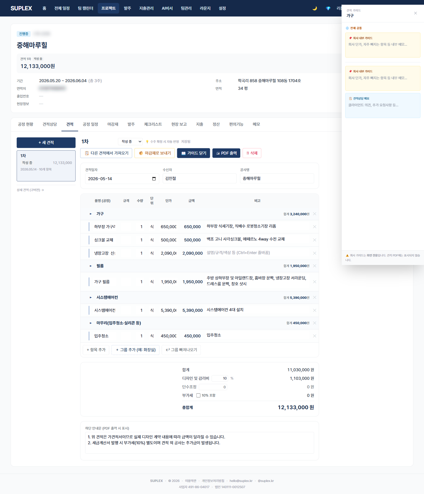

# 챕터 5. 간편 견적서

> 이 챕터를 읽고 나면 — 공정별 1장짜리 간편 견적을 작성하고, 회사 양식을 적용하며, 1차·2차 차수로 분리해 PDF로 출력할 수 있게 됩니다.

---

## 간편 견적 탭

> **이 페이지는** 한 프로젝트의 다중 차수 간편 견적을 작성·관리하는 기능을 가지고 있습니다. 프로젝트 → **간편 견적** 탭.

### 화면 한눈에

> 📸 `assets/screens/14_project_quotes.png` — 영역 ①~⑥ 라벨링 후 저장



| 번호 | 영역 | 설명 |
|---|---|---|
| ① | 견적 차수 pill | 1차·2차·… 가로 pill로 전환. SUPERSEDED 차수는 회색으로 표시 |
| ② | 옵션 패널 | 회사 양식(classic/modern) · 디자인비(기본 10%) · 부가세(기본 0%) · 단수조정 · footerNotes |
| ③ | 견적 표 본문 | 공정 그룹 헤더 + 라인 인라인 편집. 1초 자동저장 |
| ④ | 정규화 미리보기 배지 | "벽지" 입력 시 → "도배" 자동 매칭 배지 표시 — 견적·마감재 매칭 키 |
| ⑤ | 견적 가이드 드로어 | 공정별 회사 가이드(CompanyPhaseTip) 펼침. 다른 견적 작성 시 참조용 |
| ⑥ | 액션 | + 새 견적 (공종 선택 모달) · 마감재로 보내기 · PDF 인쇄 |

### 이 페이지에서 할 수 있는 것

- **공종 선택 모달로 새 견적 생성** — 체크한 공종마다 그룹 헤더 + 빈 라인 1개 자동 생성
- 견적 표에 라인 인라인 편집 (품명·규격·수량·단위·단가·비고). 마지막 필드에서 Tab → 새 행 자동 추가
- 라인 입력 시 키워드 자동 인식 → 표준 공정으로 정규화 배지 표시
- 옵션 패널에서 디자인비·부가세·단조·footerNotes 즉시 반영
- 견적 가이드 드로어에서 다른 견적의 공정별 메모 참조
- 견적 라인 → 마감재 일괄 전송 (SendToMaterialsModal)
- PDF 인쇄 — classic(빽빽한 정통형) / modern(여백 넓은 모던) 양식 중 선택
- 견적 확정 시 프로젝트 contractAmount 자동 sync
- 라인 노션 드래그 — 라인 묶음을 노션 페이지로 직접 드래그

### 간편 견적의 합계 공식

```
공정 합계          (자동, 라인 합)
+ 디자인비 (10%)   (기본 10%, 0~30% 조정 가능)
+ 단수조정          (수동, 음수·양수)
= 공급가액
+ 부가세 (0%)      (기본 0%, 10% 토글 가능)
─────────────
= 총합계
```

| 줄 | 변경 가능? | 메모 |
|---|---|---|
| 공정 합계 | 표 수정으로만 | 라인 금액 자동 합 |
| 디자인비 | ✓ 옵션 패널 | 단순 도배 5~8% / 표준 10% / 고급 15~20% |
| 단수조정 | ✓ 옵션 패널 | 36,423,750 → -23,750 → 36,400,000 식 |
| 부가세 | ✓ 옵션 패널 | 0% = "VAT 별도" 안내 / 10% = 사업자 클라이언트 |

### 이럴 때 옵니다 (시나리오)

- **첫 미팅 직후 1차 견적** — 새 견적 모달에서 공종 7~10개 체크 → 그룹 자동 생성 → 라인 단가만 채움
- **2차 견적 (변경 요청)** — 1차를 SUPERSEDED로 두고 새 견적 생성. 1차 직접 수정 X
- **클라이언트가 카톡으로 단가 질문** — pill에서 1차 견적 펼쳐서 즉시 답변
- **다른 회사 견적 참고** — 견적 가이드 드로어에서 회사 표준 가이드 펼쳐 참조

### 인접 페이지로

- → [상세 견적](07-detailed-quote.md) — 입찰·관급공사·사업자 클라이언트용 한국 표준 양식이 필요할 때
- → [견적 상담](07-detailed-quote.md#7-2-견적-상담-탭) — 공정별 협의 메모를 누적할 때
- → [마감재](05-materials.md) — 견적 라인을 마감재로 일괄 전송한 후 자재 사양 정리
- → [변경 관리](08-changes.md) — 2차 견적 만들 때

### 자주 묻는 질문

**Q. 1차 발송 후 단가만 살짝 바꾸고 싶은데 새 견적 만들기 귀찮습니다.**
A. 1차는 수정하지 않는 게 원칙입니다. 1차 복제 → 단가만 수정 → 2분이면 끝납니다. 자세한 흐름은 [챕터 7 — 변경 관리](08-changes.md).

**Q. 견적 상태는 자동으로 바뀌나요?**
A. DRAFT → SENT → ACCEPTED → SUPERSEDED 전환은 수동입니다. 발송 직후 SENT, 합의 직후 ACCEPTED, 2차 만들 때 1차를 SUPERSEDED로.

**Q. PDF가 깨져 나옵니다.**
A. 브라우저 인쇄 다이얼로그에서 "배경 그래픽" 옵션을 켜고 한글 폰트 설치 확인. 권장 브라우저는 Chrome / Edge.

**Q. 디자인비를 0%로 두고 첫 줄에 "디자인 및 감리 일괄"로 식 단위 넣어도 되나요?**
A. 가능합니다. 회사 영업 정책에 따라 결정.

**Q. 한 견적서에 두 명 고객(집주인 + 세입자) 정보를 같이 넣고 싶습니다.**
A. PDF 헤더는 1명. 두 명 정보는 프로젝트 비고 또는 footerNotes에 기재.

---

[← 챕터 4](05-materials.md) · [다음: 챕터 6 — 상세 견적서 →](07-detailed-quote.md)
