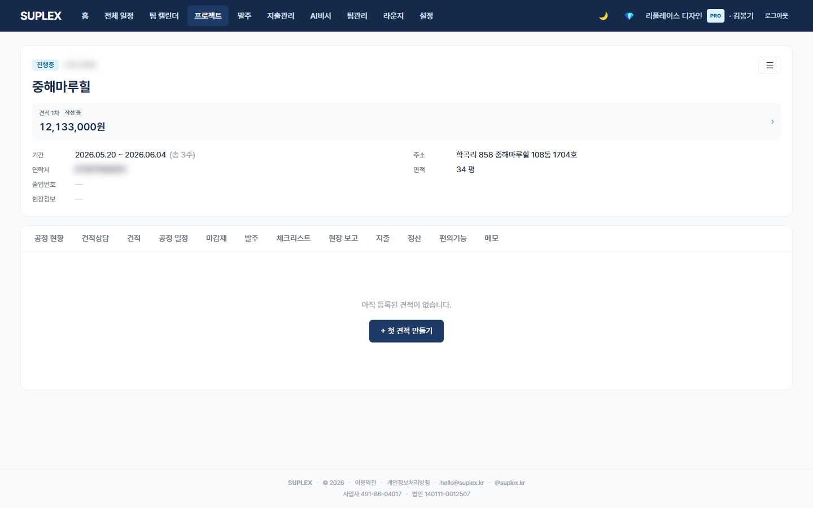
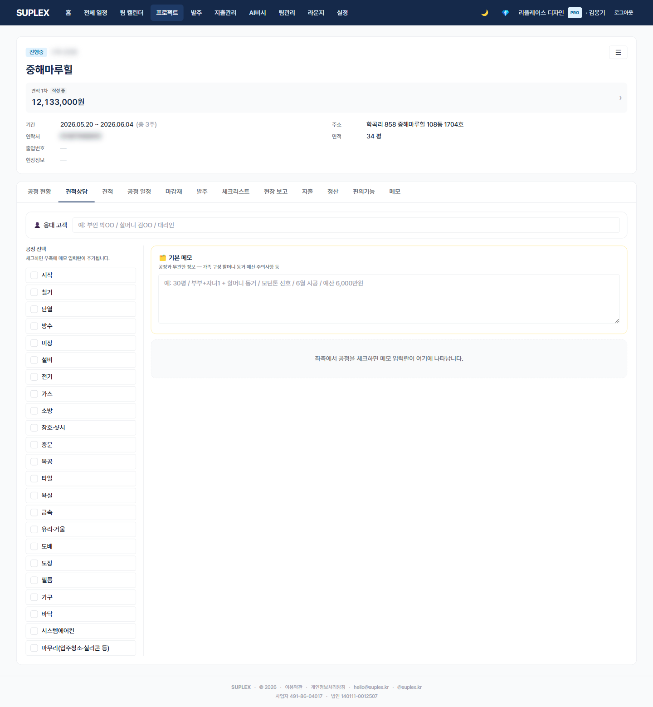

# 챕터 6. 상세 견적서 · 견적 상담

> ⚠️ **v0.7 1차 — 추후 보완 예정** (봉기님 결정, 2026-05-17). 상세 견적 영역은 18행 원가내역서·비율 토글 등 사용 시나리오가 다양해 본문 추가 보강이 필요. 현재 골격만.

> 이 챕터를 읽고 나면 — 한국 인테리어 표준 양식(갑지 + 18행 원가내역서)으로 상세 견적을 작성하고, 공정별 상담 메모를 누적해 다음 견적에 활용할 수 있게 됩니다.

---

## 7-1. 상세 견적 탭

> **이 페이지는** 한국 건설·인테리어 업계 표준 양식(갑지 + 18행 원가내역서 + 공종별 표)으로 견적을 작성하는 기능을 가지고 있습니다. 프로젝트 → **상세 견적** 탭.

### 화면 한눈에

> 📸 `assets/screens/15_project_quotes_detail.png` — 영역 ①~⑥ 라벨링 후 저장

| 번호 | 영역 | 설명 |
|---|---|---|
| ① | 견적 pill | 다중 차수 전환 |
| ② | 갑지 (표지) | 공사명·발주처·도급자·공사위치·공사기간·총공사비 |
| ③ | 공종별 라인 표 | 13개 표준 공종(가설·철거·목공·조적·도배·바닥·타일·도장·전기·설비·가구·가전·청소). 자재비·노무비·경비 분리 입력 |
| ④ | 18행 원가내역서 | 직접재료비·간접재료비·노무비·각종 보험료·일반관리비·이윤·부가세 18행. 12개 비율 스냅샷 + 11개 적용 토글 |
| ⑤ | 평당 단가·한글 금액 | 자동 계산 (총공사비 ÷ 면적 + numberToKorean) |
| ⑥ | 액션 | + 새 견적 · 복제 · 삭제 · PDF 인쇄 |

### 이 페이지에서 할 수 있는 것

- 공종별 라인을 자재비·노무비·경비 3분할로 입력
- 18행 원가내역서 비율 항목별 ON/OFF 토글 (예: 안전관리비만 켜기)
- 회사 기본 비율 사용 또는 견적별 재정의
- 견적 복제 — 1차 복사 후 2차 단가만 수정
- 평당 단가 + 한글 금액 자동 표기 (계약서·공식 문서용)
- PDF 인쇄 — 갑지 / 원가내역서 / 공종 요약 / 공종별 세부 4섹션

### 자재비·노무비·경비 분리

| 분류 | 의미 | 예시 |
|---|---|---|
| 자재비 | 자재 자체 가격 | 강마루 75,000원/m² |
| 노무비 | 인건비 (시공 인력) | 시공비 20,000원/m² |
| 경비 | 자재·노무 외 비용 | 운반비, 폐기물처리비 등 |

분리 입력하지 않고 자재비에 모두 넣고 노무비 0으로 두어도 PDF는 정상 출력됩니다. 점진적으로 분리하면 됩니다.

### 이럴 때 옵니다 (시나리오)

- **사업자 클라이언트 정식 견적** — 갑지에 회사 사업자등록번호·도장 포함
- **입찰·관급공사 제출** — 18행 원가내역서 필수
- **변경 견적** — 1차 복제 → 변경된 공종 라인만 수정 → 2차로 분리

### 인접 페이지로

- → [간편 견적](06-simple-quote.md) — 일반 가정 클라이언트·빠른 산출용
- → [견적 상담](#7-2-견적-상담-탭) — 공정별 협의 메모 누적
- → [설정 → 견적 기본비율](17-settings.md) — 회사 12개 비율 기본값 등록

---

## 7-2. 견적 상담 탭

> **이 페이지는** 공정별 협의 메모를 한 화면에서 누적하고 다음 견적 작성에 참조하는 기능을 가지고 있습니다. 프로젝트 → **견적 상담** 탭.

### 화면 한눈에

> 📸 `assets/screens/16_project_quote_consultations.png` — 영역 ①~⑤ 라벨링 후 저장

| 번호 | 영역 | 설명 |
|---|---|---|
| ① | 좌측 공정 체크박스 | 24개 표준 공정 (OTHER 제외). 메모 있는 공정 자동 ON |
| ② | 우측 상단 기본 메모 | 공정에 속하지 않는 일반 협의 사항. 항상 표시 |
| ③ | 우측 공정별 메모 카드 | 체크된 공정마다 카드 1장. textarea 자유 입력 |
| ④ | 자동저장 | textarea blur 시 즉시 저장. 빈 메모는 자동 삭제 |
| ⑤ | 마지막 수정자·시각 | 누가 언제 마지막으로 수정했는지 카드 하단 표시 |

### 이 페이지에서 할 수 있는 것

- 공정 체크 → 우측에 메모 카드 1장 생성
- 미팅 중 협의 사항을 공정별로 즉시 기록 (textarea blur 자동저장)
- 메모 비우면 자동 삭제 + 체크박스 자동 해제
- 다음 견적 작성 시 견적 가이드 드로어(간편 견적 탭)에서 본 메모를 펼쳐 참조
- 누가 마지막으로 수정했는지 추적

### 이럴 때 옵니다 (시나리오)

- **첫 클라이언트 미팅** — 공정별 협의 메모를 카드로 분리해 기록 → 다음 견적 작성 시 prefill 참조
- **공종별 거래처 견적 의견** — "도배는 LX 실크지로, 단가 8천원/롤" 같은 협의 메모를 도배 카드에 누적
- **인수인계** — 다른 팀원이 견적 상담 탭만 보면 어떤 협의가 있었는지 파악

### 인접 페이지로

- → [간편 견적](06-simple-quote.md) — 메모를 참조하며 새 견적 작성
- → [상세 견적](#7-1-상세-견적-탭) — 정식 견적으로 옮길 때
- → [메모](12-memo.md) — 공정 무관 일반 프로젝트 메모

### 자주 묻는 질문

**Q. 일반 메모 탭과 어떻게 다른가요?**
A. 일반 메모는 자유 형식, 견적 상담은 **공정 단위 구조**입니다. 견적 작성 시 견적 가이드 드로어가 이 메모를 공정별로 펼쳐 보여줍니다.

**Q. 한 공정 카드에 너무 많이 적혀 있어 정리하고 싶습니다.**
A. 카드 안에서 줄바꿈으로 구분하거나, 협의 종료 후 핵심만 남기고 정리. 본 페이지 자체는 자유 입력입니다.

---

[← 챕터 5](06-simple-quote.md) · [다음: 챕터 7 — 변경 관리 →](08-changes.md)
