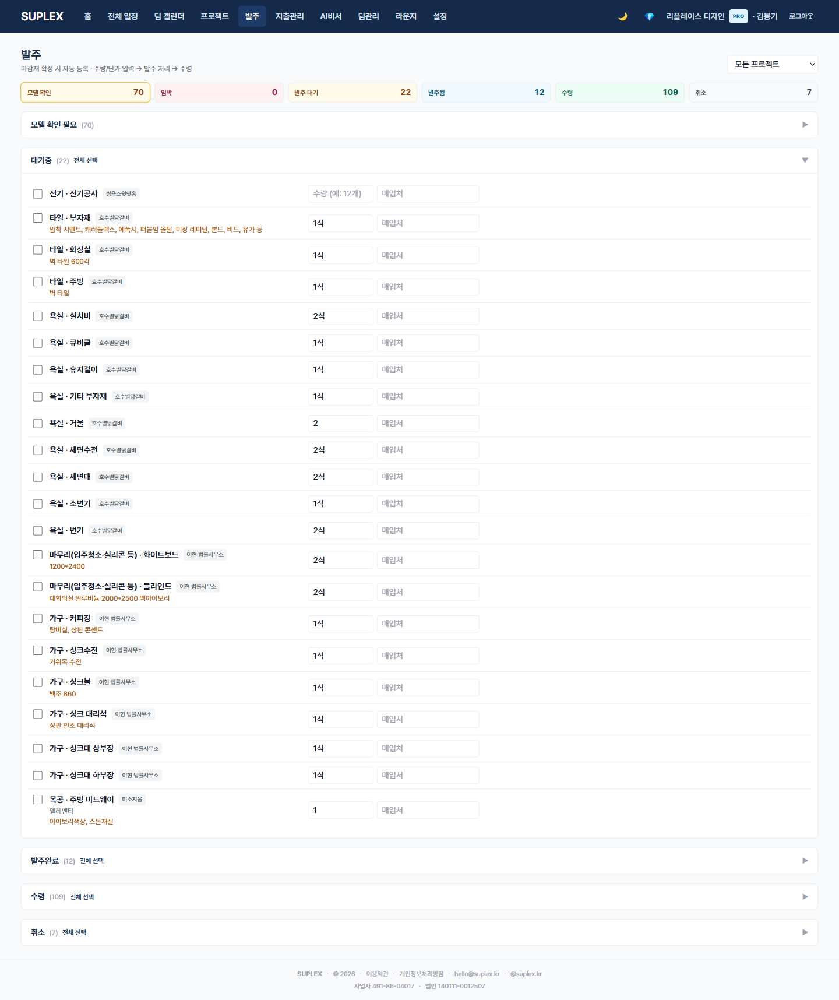
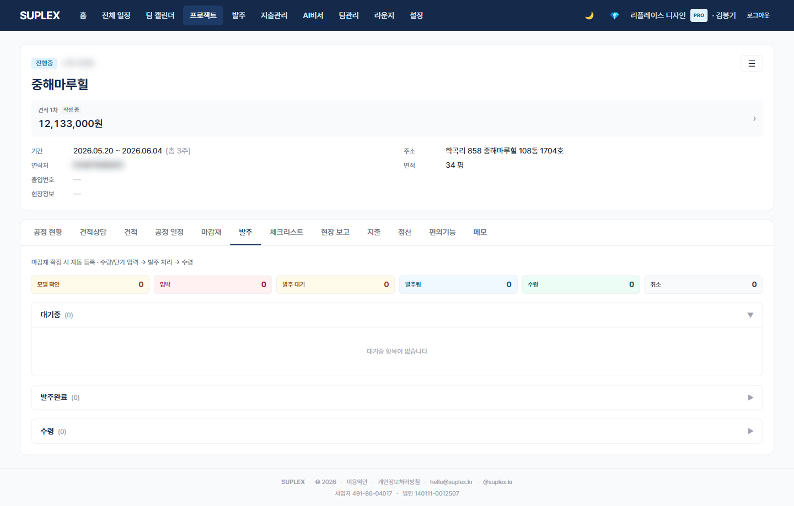

# 챕터 8. 발주

> 이 챕터를 읽고 나면 — 거래처에 보낼 발주를 마감재와 연결해 만들고, 상태별로 추적하며, 발주 후 자재 변경을 자동 감시할 수 있게 됩니다.

---

## 발주의 두 진입점

| 위치 | 단위 | 용도 |
|---|---|---|
| **상위 메뉴 → 발주** | 회사 전체 | 모든 현장 발주 일괄 뷰, 거래처별 묶음 처리 |
| **프로젝트 → 발주 탭** | 한 프로젝트 | 한 현장의 발주만 |

두 페이지는 **같은 컴포넌트**이며 프로젝트 탭은 projectId 잠금만 추가됩니다.

---

## 8-1. 전사 발주 페이지

> **이 페이지는** 회사 모든 현장의 발주를 상태별로 모아 보여주고, 다중 선택해 일괄 처리하는 기능을 가지고 있습니다. 좌측 메뉴 **발주** 클릭.

### 화면 한눈에

> 📸 `assets/screens/05_orders.png` — 영역 ①~⑥ 라벨링 후 저장

| 번호 | 영역 | 설명 |
|---|---|---|
| ① | 페이지 타이틀 | "발주" |
| ② | 요약 카드 | 대기 · 발주 완료 · 수령 · 취소 + **⚠️ 변경된 발주**. 카드 클릭 → 필터 토글 |
| ③ | 프로젝트 셀렉트 | 특정 프로젝트만 필터 (전사 페이지에서만 표시) |
| ④ | 발주 표 | 거래처 · 항목 · 마감재 연결 · 금액 · 발주일 · 기대수령일 · 상태 |
| ⑤ | 다중 선택 + 일괄 액션 | 체크박스 → 일괄 상태 변경 · 카톡 복사 |
| ⑥ | ⚠️ 변경 표시 | 발주 후 마감재가 수정된 행에 자동 표시. 거래처 통보·재발주 필요 신호 |

### 이 페이지에서 할 수 있는 것

- 회사 전체 발주를 한 표로 조망
- 요약 카드 클릭 → 해당 상태만 필터 (PENDING/ORDERED/RECEIVED/CANCELLED + 변경된 발주)
- 다중 체크 → 일괄 상태 변경 (CANCELLED 시 마감재 자동 미정 복귀)
- 선택 발주 카톡 복사 (거래처별·항목별 정리된 텍스트 + 회사 푸터)
- 발주 후 마감재 변경 자동 감시 — materialChangedAt 타임스탬프
- 프로젝트 필터로 특정 현장만 분리

### 발주 상태

| 상태 | 의미 | 다음 |
|---|---|---|
| PENDING | 대기 — 거래처 발송 전 | 발송 → ORDERED |
| ORDERED | 발주 완료, 거래처 확인됨 | 입고 → RECEIVED |
| RECEIVED | 수령 완료 | (종료) |
| CANCELLED | 취소. 연결된 마감재는 미정으로 복귀 | (종료) |

### 이럴 때 옵니다 (시나리오)

- **이번 주 거래처 전화 라운드** — 요약 카드 ORDERED 클릭 → 입고 미확정 발주만 모아 거래처 응대
- **클라이언트 변경 요청 처리** — ⚠️ 변경 표시 클릭 → 거래처 통보 또는 재발주 결정
- **거래처별 일괄 정리** — 다중 체크 → 카톡 복사 → 거래처 채널 붙여넣기
- **월말 정산** — 프로젝트 필터 → RECEIVED 합계 → 지출 모듈로

### 인접 페이지로

- → [프로젝트 발주 탭](#8-2-프로젝트-발주-탭) — 한 현장만 좁혀서 작업
- → [마감재](05-materials.md) — 변경된 마감재 정리
- → [지출 관리](14-expenses.md) — 발주 수령 후 지출 사후 라벨링

---

## 8-2. 프로젝트 발주 탭

> **이 페이지는** 한 프로젝트의 발주만 좁혀서 보는 기능을 가지고 있습니다. 프로젝트 → **발주** 탭. 전사 페이지와 동일하지만 프로젝트 셀렉트가 잠겨 있습니다.

### 화면 한눈에

> 📸 `assets/screens/18_project_orders.png` — 영역 ①~⑤ 라벨링 후 저장

| 번호 | 영역 | 설명 |
|---|---|---|
| ① | 프로젝트 헤더 + 13탭 네비 | 다른 탭(견적·마감재·일정 등)으로 즉시 이동 |
| ② | 요약 카드 | 이 프로젝트의 PENDING/ORDERED/RECEIVED/CANCELLED + ⚠️ |
| ③ | 발주 표 | 프로젝트 셀렉트 숨김. 거래처·항목·마감재·금액·상태 |
| ④ | 다중 선택 + 일괄 액션 | 전사 페이지와 동일 |
| ⑤ | ⚠️ 변경 표시 + 마감재 점프 | 클릭 → 마감재 탭의 해당 행으로 이동 |

### 이 페이지에서 할 수 있는 것

- 전사 페이지 기능 그대로 (단, 프로젝트 1개로 잠금)
- ⚠️ 행 클릭 → 마감재 탭의 변경된 자재로 즉시 점프
- 마감재 탭에서 status=CONFIRMED 전이 시 자동 PENDING 발주 생성 (1마감재 = 1발주)

### 이럴 때 옵니다 (시나리오)

- **마감재 확정 직후** — 자동 생성된 PENDING 발주를 ORDERED로 일괄 전환
- **입고 검수** — RECEIVED 표시 + 입고 사진을 현장보고에 첨부
- **분쟁 시점 추적** — ⚠️ 행 → 마감재 변경 이력 확인

### 인접 페이지로

- → [마감재](05-materials.md) — ⚠️ 점프 + 자재 상태 확인
- → [공정 현황](13-schedule.md#12-3-공정-현황-탭) — 공정별 발주 진행도 통합 뷰
- → [현장보고](11-daily-report.md) — 입고 사진 첨부

### 자주 묻는 질문

**Q. 발주 PDF는 어디서 출력하나요?**
A. 발주 행 선택 → 카톡 복사 또는 회사 양식 PDF 인쇄(준비 중). 베타에는 카톡 텍스트 형식이 주력.

**Q. 마감재를 수정했는데 발주에 ⚠️가 안 떠요.**
A. ⚠️는 발주 상태가 ORDERED 이상일 때만 표시됩니다. PENDING 발주는 마감재 변경이 그대로 발주에 반영(자동 sync).

**Q. CANCELLED 처리 시 마감재가 미정으로 돌아간다는데 다시 복구 가능한가요?**
A. 마감재 탭에서 status를 직접 CONFIRMED로 되돌리면 됩니다. 새 발주가 자동 생성됩니다.

---

[← 챕터 7](08-changes.md) · [다음: 챕터 9 — 체크리스트 →](10-checklist.md)
