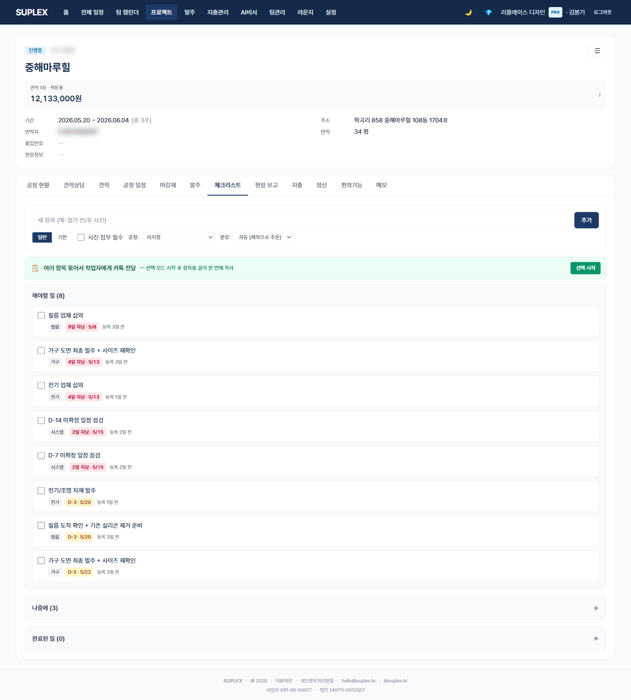

# 챕터 9. 체크리스트

> 이 챕터를 읽고 나면 — 공종별 점검 항목을 등록해 마감 전 누락을 줄이고, 작업자에게 카톡으로 깔끔하게 전달하며, 회사 표준 룰을 자동 시드 받을 수 있게 됩니다.

---

## 체크리스트의 두 단위

| 위치 | 단위 | 용도 |
|---|---|---|
| **프로젝트 → 체크리스트 탭** | 한 프로젝트 안 | 공종별 점검·작업자 카톡 전달 |
| **전체 일정 → 통합 체크리스트** | 회사 전체 | 마감 임박 항목 일괄 점검 (챕터 12 참조) |
| **홈 → 3일 안에 할 일** | 본인 역할 한정 | 출근 직후 본인이 처리할 것만 (챕터 2 참조) |

이 챕터는 **프로젝트 체크리스트**를 다룹니다.

---

## 프로젝트 체크리스트 탭

> **이 페이지는** 한 프로젝트의 공정별 점검 항목을 관리하고, 작업자에게 카톡으로 전달하는 기능을 가지고 있습니다. 프로젝트 → **체크리스트** 탭.

### 화면 한눈에

> 📸 `assets/screens/19_project_checklist.png` — 영역 ①~⑦ 라벨링 후 저장

| 번호 | 영역 | 설명 |
|---|---|---|
| ① | 좌우 분할 | 좌 — Todo (미완료) / 우 — Done (완료) |
| ② | 신규 입력 폼 | 제목 + 공정 태그 + team(자동/현장/디자인/발주/기타) + DUE/GENERAL 종류 + 사진 필수 토글 |
| ③ | 일정 가져오기 | DUE 모드 → 일정 시트 → 이미 입력된 공정 일정을 체크리스트로 변환 (linkedScheduleId 연결) |
| ④ | 어드바이스 자동 항목 | 회사 룰(설정 → 어드바이스)이 등록되어 있으면 새 프로젝트에 자동 시드됨. D-14 / D-7 같은 시스템 룰도 자동 |
| ⑤ | 묶음 모드 | 여러 항목 체크 후 한 번에 카톡 양식으로 클립보드 복사 |
| ⑥ | 사진 첨부 | requiresPhoto=true 항목은 처리 후 사진 증빙 권장. 항목 하단 사진 영역 |
| ⑦ | 회사 컬러 일정 라벨 | 공정 칩이 회사 phaseLabels 컬러로 표시 |

### 이 페이지에서 할 수 있는 것

- **공정 태그 자동 추론** — 제목에 "타일" 적으면 공정 칩 자동 부여 (회사 키워드 룰)
- **team 자동 추론** — 자동 옵션 두면 항목 내용 기반으로 현장/디자인/발주/기타 분류 → 홈 카드 역할 라우팅에 사용
- **DUE 모드 + 일정 연결** — 일정에 있는 공정을 한 번에 체크리스트로 → 마감일 자동 채움
- **카톡 양식 자동** — 한 항목이면 "[공정] 항목, 기한 X/X, 사진 부탁드립니다" / 여러 개면 번호 매김 / 회사·현장명 컨텍스트 자동
- **사진 필수 토글** — 누락 방지용 증빙 강제
- **완료 시 자동 분리** — Done 영역으로 자동 이동, linkedScheduleId 있으면 일정의 ✓ 확정도 자동

### 이럴 때 옵니다 (시나리오)

- **공사 시작 전** — 회사 표준 어드바이스가 자동 시드되어 있는지 확인, 빠진 거 보강
- **공정 마감 D-7** — 시스템 룰이 자동 생성한 점검 항목 처리 (예: "도배 작업 전 풀 종류 확인")
- **작업자에게 단체 전달** — 묶음 모드로 여러 항목 선택 → 클립보드 → 작업자 카톡방 붙여넣기
- **하자 보수 알림 받았을 때** — 빠뜨린 점검 항목을 회사 어드바이스에 등록 → 다음 프로젝트부터 자동 시드

### 인접 페이지로

- → [전체 일정 통합 체크리스트](13-schedule.md) — 회사 모든 현장 마감 임박 항목 일괄 뷰
- → [홈 — 3일 안에 할 일](03-home.md) — 본인 역할 한정 마감 임박 자동 추출
- → [공정 일정](13-schedule.md#12-2-프로젝트-공정-일정-탭) — 일정 가져오기 입력 모드
- → [설정 → 어드바이스 룰](17-settings.md) — 회사 표준 룰 등록·관리

### 자주 묻는 질문

**Q. 회사 표준 룰은 어디서 관리하나요?**
A. 설정 → 공정별 어드바이스. 한 번 등록해두면 모든 신규 프로젝트에 자동 시드됩니다 (단, 신규 시드는 비활성 상태로 들어와서 사용자가 직접 켜야 적용 — 2026-05-15 정책).

**Q. 시스템 룰(D-14·D-7)이 자동 생성되는데 끄려면?**
A. 설정 → 어드바이스 → ruleType=UNCONFIRMED_CHECK 항목 비활성화. 회사 단위 옵션입니다.

**Q. 일정 가져오기를 누르면 어떤 일이 일어나나요?**
A. 이미 입력된 공정 일정 중 선택한 entry가 체크리스트 항목으로 복사되고 `linkedScheduleId`로 연결됩니다. 체크리스트를 완료 처리하면 일정의 ✓ 확정도 자동 함께 토글됩니다.

**Q. team(현장/디자인/발주/기타)은 왜 분류하나요?**
A. 홈의 "3일 안에 할 일" 카드가 사용자 역할(FIELD/DESIGN/...)별로 본인 일만 모아 보여주기 위해서입니다. 현장팀에게 디자인 결정 항목이 떠 있으면 노이즈이기 때문입니다.

---

[← 챕터 8](09-orders.md) · [다음: 챕터 10 — 현장보고 →](11-daily-report.md)
