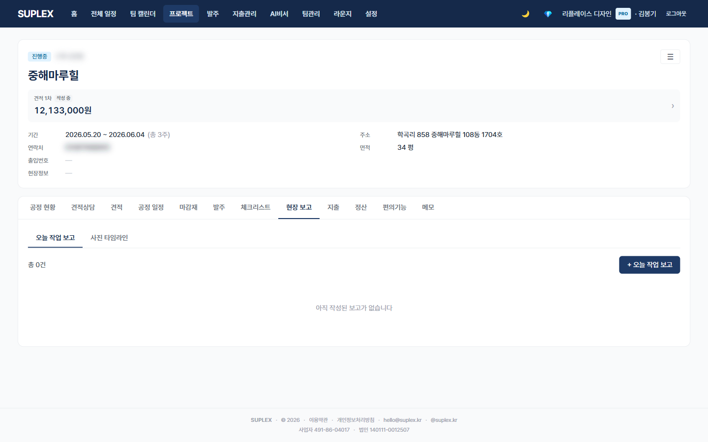

# 챕터 10. 현장보고

> 이 챕터를 읽고 나면 — 현장 작업을 사진과 함께 매일 기록하고, 날짜별 사진 타임라인으로 진행 흐름을 한눈에 볼 수 있게 됩니다.

---

## 현장보고 탭

> **이 페이지는** 현장 작업 보고와 사진 타임라인을 두 서브탭에서 관리하는 기능을 가지고 있습니다. 프로젝트 → **현장보고** 탭.

### 화면 한눈에

> 📸 `assets/screens/20_project_reports.png` — 영역 ①~⑤ 라벨링 후 저장

| 번호 | 영역 | 설명 |
|---|---|---|
| ① | 서브탭 | **오늘 작업 보고** · **사진 타임라인** |
| ② | 보고 카드 리스트 (오늘 작업 보고 탭) | 날짜·작성자·진행 공종·진행률·workerCount·next plan + 사진 썸네일 |
| ③ | + 새 보고 모달 | 날짜·진행 공종 다중 선택·사진 다중 업로드·메모·다음 일정 |
| ④ | 사진 타임라인 그리드 (사진 타임라인 탭) | 일자별 사진 묶음. source(REPORT/ISSUE/MATERIAL_REQUEST) 필터 |
| ⑤ | 사진 라이트박스 | 사진 클릭 → 큰 화면 + 캡션 + 다운로드 |

### 이 페이지에서 할 수 있는 것

- 일일 보고 작성 — 진행 공종·인원수·다음 일정·사진을 한 카드에 묶음
- 사진 휴대폰에서 직접 업로드 (Cloudinary 자동 썸네일 400×400 eager 생성)
- 진행 공종 다중 선택 (목공·전기·타일 등 25 표준 공정 중)
- 사진 타임라인에서 시공 전후 비교 (같은 위치 다른 날짜)
- 사진 source 필터 (REPORT / ISSUE / MATERIAL_REQUEST)
- 사진 라이트박스에서 캡션·다운로드

### 이럴 때 옵니다 (시나리오)

- **현장 도착 직후·마감 직전 휴대폰 입력** — 같은 위치를 매일 같은 각도에서 촬영
- **클라이언트 진행 문의** — "지금 어디까지?" → 사진 타임라인 캡처 → 카톡 전송
- **재시공 요청 대응** — 시공 직전·직후 사진으로 시공 품질 증명
- **자재 입고 검수** — 박스·라벨 사진을 보고에 첨부 → 거래처 검증 자료

### 사진 첨부 팁

| 팁 | 효과 |
|---|---|
| 같은 위치를 매일 같은 각도에서 촬영 | 진행 비교 가능 |
| 자재 입고 시 라벨·박스 사진 | 거래처 자재 검증 |
| 시공 직전·직후 비교 사진 | 변경 추적 |
| 휴대폰 시간 자동 동기화 켜두기 | 메타데이터에 정확한 시간 |

### 인접 페이지로

- → [공정 일정](13-schedule.md#12-2-프로젝트-공정-일정-탭) — 보고된 작업의 일정 입력·수정
- → [체크리스트](10-checklist.md) — 점검 항목 사진 증빙 (requiresPhoto 토글)
- → [발주](09-orders.md) — 입고 사진 → 발주 RECEIVED 전환

### 자주 묻는 질문

**Q. 휴대폰 카메라 화질이 너무 큰데 자동으로 줄여주나요?**
A. 업로드 시 원본 + 400×400 썸네일이 자동 생성됩니다. 보고 카드 리스트는 썸네일, 라이트박스는 원본.

**Q. 자재 발주 요청(MaterialRequest) 탭이 안 보입니다.**
A. 발주 메뉴로 이전됨(2026-04-29). MaterialRequest 데이터는 보존되어 있으며 사진 타임라인 source 필터에서 확인 가능합니다.

**Q. 사진을 일괄 다운로드하고 싶습니다.**
A. 현재 라이트박스에서 1장씩 다운로드. 일괄 다운로드는 정식 출시 검토.

**Q. 데스크톱에서도 가능한가요?**
A. 가능하지만 모바일 권장 — 현장에서 휴대폰으로 사진 찍어 즉시 입력이 가장 효율적.

---

[← 챕터 9](10-checklist.md) · [다음: 챕터 11 — 메모 →](12-memo.md)
