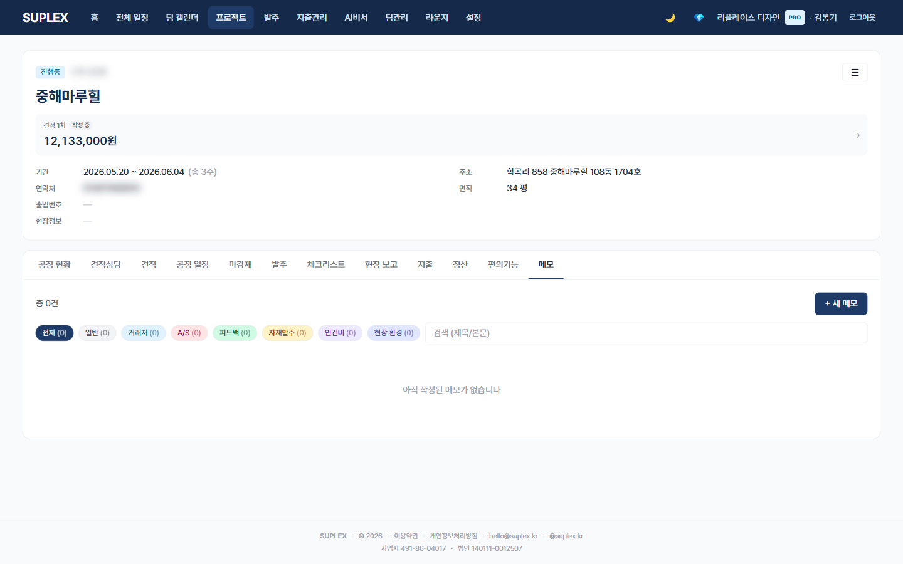

# 챕터 11. 메모

> 이 챕터를 읽고 나면 — 7개 태그로 분류된 카드 메모를 작성하고, 거래처·A/S·피드백 이력을 프로젝트별로 누적해 다음 결정에 활용할 수 있게 됩니다.

---

## 프로젝트 메모 탭

> **이 페이지는** 프로젝트의 잡다한 정보를 7개 태그로 분류된 카드로 저장하고 검색하는 기능을 가지고 있습니다. 프로젝트 → **메모** 탭.

### 화면 한눈에

> 📸 `assets/screens/21_project_memo.png` — 영역 ①~⑤ 라벨링 후 저장

| 번호 | 영역 | 설명 |
|---|---|---|
| ① | 상단 액션 | + 새 메모 모달 · 검색 input |
| ② | 태그 필터 칩 | 7개 태그 + 전체. 클릭 → 해당 태그만 표시 |
| ③ | 카드 그리드 | Google Keep 스타일. 카드별 색상 = 태그. 인라인 편집 800ms 자동저장 |
| ④ | + 새 메모 모달 | 태그 선택 → 그 태그의 placeholder·hint·예시가 동적으로 노출 |
| ⑤ | 이미지 라이트박스 | 카드에 첨부된 이미지 클릭 → 큰 화면 |

### 7개 태그

| 태그 | 색 | 용도 |
|---|---|---|
| 일반 | 회색 | 자유 메모 — 회의 일정·아이디어·TODO |
| 거래처 | 하늘 | 협력업체·시공팀 단가·일정 준수·품질·재계약 여부 |
| A/S | 분홍 | 하자·재시공 이력 — 발생 원인·조치 결과·책임 소재 |
| 피드백 | 초록 | 자체 회고 — 자재 모델 평가·디자인 인사이트 |
| 자재발주 | 노랑 | 추가 자재 요청 메모 (발주 모듈로 옮기기 전 단계) |
| 인건비 | 보라 | 인건비 정산 카톡 자동 기록 (편의기능 탭에서 자동 push) |
| 이슈 | 빨강 | 현장 즉시 처리 필요 사항 |

### 이 페이지에서 할 수 있는 것

- 카드 인라인 편집 — 제목·본문·태그·이미지 첨부. 800ms 자동저장
- 새 메모 모달에서 태그 선택 시 placeholder·hint·예시가 동적으로 바뀜 (입력 가이드 자동 노출)
- 태그 칩 클릭 → 해당 태그만 필터
- 검색 — 제목·본문 전체 텍스트
- 이미지 라이트박스로 첨부 사진 확대
- 핀 고정으로 상단 영구 노출
- 카톡 복사 (회사 푸터 자동 첨부)

### 이럴 때 옵니다 (시나리오)

- **첫 미팅 노트 정리** — "일반" 태그로 클라이언트 정보·취향·다음 액션 한 카드
- **거래처 평가 누적** — "거래처" 태그로 협력업체별 단가·품질 메모 → 다음 프로젝트 거래처 선정 자료
- **A/S 발생 시** — "A/S" 태그로 원인·조치·책임 기록 → 분쟁·평가용
- **자재 회고** — "피드백" 태그로 자재 모델 평가 → 다음 견적 자료
- **인건비 정산 자동 기록** — 편의기능 탭의 인건비 정산 모달 → 카톡 복사 + "인건비" 태그로 메모 자동 push

### 인접 페이지로

- → [편의기능 → 인건비 정산](19-utilities.md#인건비-정산) — "인건비" 태그 메모 자동 출구
- → [공정 일정](13-schedule.md) — 일정 비고와 메모 분리
- → [현장보고](11-daily-report.md) — 사진 + 진행 보고 분리

### 자주 묻는 질문

**Q. 메모와 견적 상담 탭의 차이는?**
A. 메모는 자유 형식·태그 분류, 견적 상담은 **공정 단위 구조** 메모. 견적 작성 시 견적 가이드 드로어가 견적 상담 메모만 펼침. 메모는 공정 무관 일반 정보.

**Q. 인건비 정산을 하면 왜 메모에 자동 기록되나요?**
A. 지출 격리 정책상 인건비를 지출 모듈로 자동 push하지 않습니다. 대신 메모 탭에 "인건비" 태그로 기록 → 사용자가 메모에서 정산 이력을 자연스럽게 확인. 자세한 흐름은 [편의기능 챕터](19-utilities.md).

**Q. 사진을 메모에 첨부할 수 있나요?**
A. 가능. 라이트박스로 확대 표시.

**Q. 회사 전체 메모 검색은 어디서?**
A. 본 페이지는 한 프로젝트의 메모만 다룹니다. 회사 전체 메모 검색은 AI 비서 또는 정식 출시 시 별도 검토.

---

[← 챕터 10](11-daily-report.md) · [다음: 챕터 12 — 일정 관리 →](13-schedule.md)
