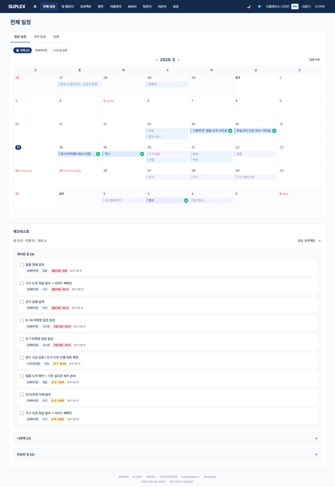
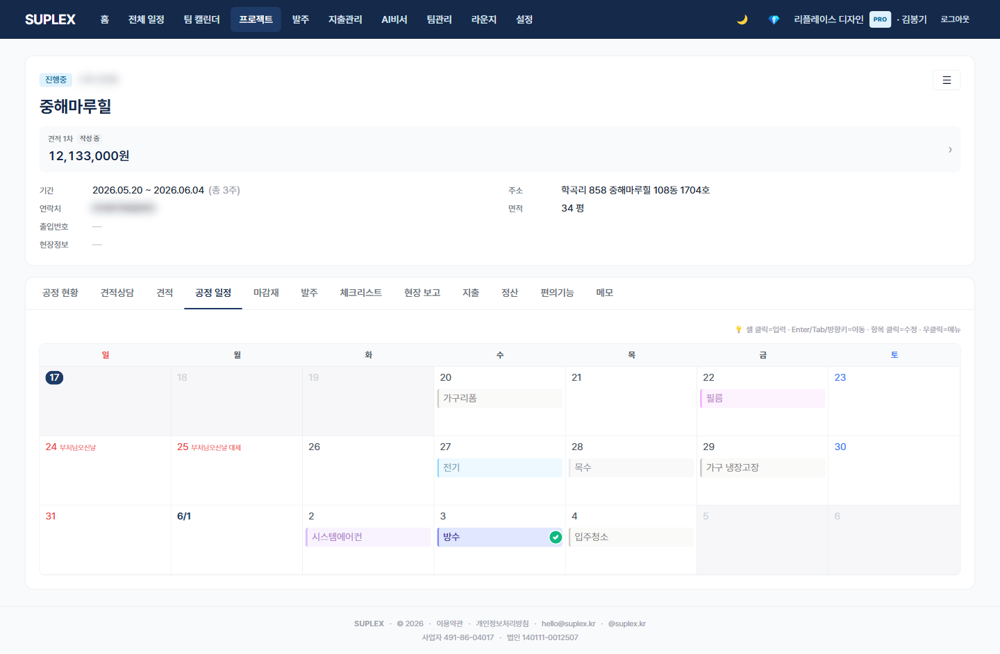
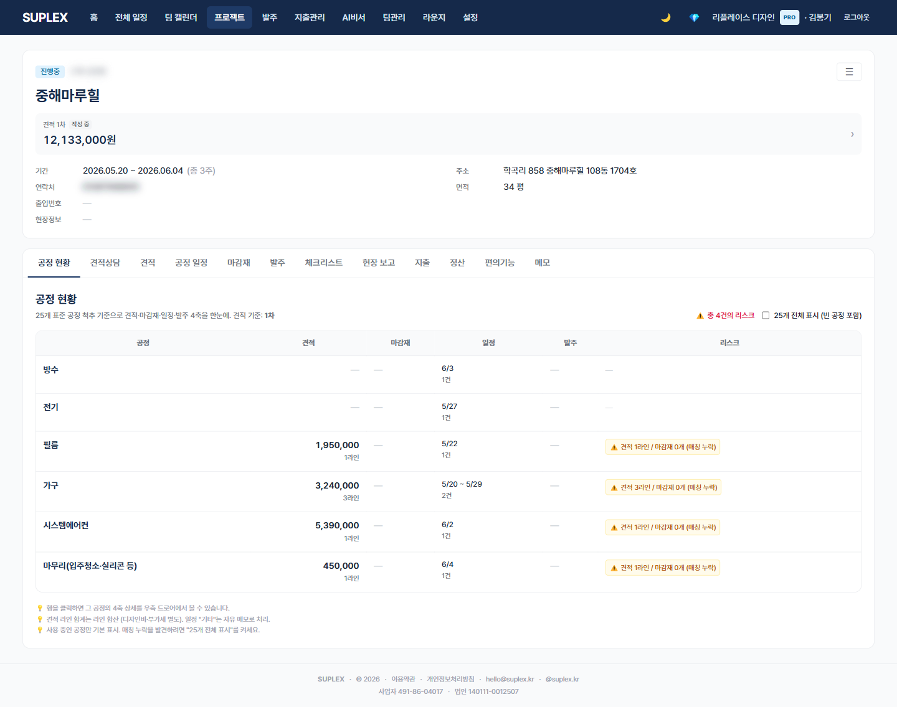

# 챕터 12. 일정 관리

> 이 챕터를 읽고 나면 — 회사 전체 현장의 일정을 한 캘린더에서 조망하고, 각 프로젝트의 공정별 작업을 일자에 직접 꽂으며, 작업자에게 카톡으로 일정을 전달할 수 있게 됩니다.

---

## 일정의 두 단위

| 위치 | 단위 | 용도 |
|---|---|---|
| **전체 일정** (좌측 메뉴) | 회사 전체 모든 현장 | 거래처 일정 충돌·자원 배분·주간 브리핑 |
| **프로젝트 → 공정 일정 탭** | 한 프로젝트 안 | 일별·공정별 작업 계획 |

두 화면은 **같은 데이터의 두 가지 뷰**입니다. 프로젝트 탭에서 입력한 일정이 전체 일정에 자동 집계됩니다.

---

## 12-1. 전체 일정 페이지

> **이 페이지는** 회사 모든 현장의 일정을 하나의 캘린더에 모아 보여줍니다. 좌측 메뉴 **일정** 클릭.

### 화면 한눈에

> 📸 `assets/screens/02_schedule.png` — 영역 ①~⑤ 라벨링 후 저장

| 번호 | 영역 | 설명 |
|---|---|---|
| ① | 페이지 타이틀 | "전체 일정" |
| ② | 서브탭 | **현장 일정**(시공 중 IN_PROGRESS) · **견적 일정**(PLANNED) · **전체** |
| ③ | 통합 캘린더 (Aggregate) | 모든 현장의 공정 작업이 일자에 색상 칩으로 표시. 회사 컬러 라벨·거래처별 색 분류 |
| ④ | 통합 체크리스트 (Aggregate) | 회사 전체 체크리스트 중 마감·진행 상태 일괄 뷰 |
| ⑤ | 일정 복사 액션 | "전체 탭"에서 키워드·기간 선택 → 클립보드 복사 → 카톡 붙여넣기 |

### 이 페이지에서 할 수 있는 것

- 이번 주·다음 주 회사 모든 현장의 일정 한눈에
- 거래처 일정 충돌 발견 ("김씨 도배팀이 5/20 두 현장에 동시")
- 키워드(예: "타일")로 특정 공정만 모아서 카톡 복사
- 통합 체크리스트에서 회사 전체 마감 임박 항목 일괄 점검

### 이럴 때 옵니다 (시나리오)

- **월요일 주간 회의 직전** — 이번 주 모든 현장 작업 한 화면에 펴 놓고 브리핑
- **거래처 일정 잡을 때** — 다른 현장과 충돌 없는지 즉시 확인
- **공종별 작업자에게 단체 카톡** — "이번 주 모든 타일 작업" 키워드 추출 → 클립보드 → 단체방

### 인접 페이지로

- → [홈](03-home.md) — 이번 주만 빠르게 확인할 때
- → [프로젝트 공정 일정 탭](#12-2-프로젝트-공정-일정-탭) — 일정을 입력·수정할 때
- → [체크리스트](10-checklist.md) — 회사 전체 마감 임박 항목 정리

---

## 12-2. 프로젝트 공정 일정 탭

> **이 페이지는** 한 프로젝트 안에서 공정별 작업을 일자에 직접 꽂는 곳입니다. 프로젝트 진입 시 기본으로 열리는 탭입니다.

### 화면 한눈에

> 📸 `assets/screens/12_project_schedule.png` — 영역 ①~⑥ 라벨링 후 저장

| 번호 | 영역 | 설명 |
|---|---|---|
| ① | 프로젝트 헤더 | 프로젝트명·고객·면적·기간·햄버거 메뉴 (변동 로그·일정 복사·수정·백업) |
| ② | 13탭 네비 | schedule(현재)·공정현황·간편견적·상세견적·견적상담·마감재·발주·체크리스트·현장보고·메모·지출·정산·편의기능 |
| ③ | 캘린더 본문 | 일자 셀 안에 공정 색상 칩 + 작업 내용 텍스트 |
| ④ | 인라인 입력 (PhaseInline) | 셀 클릭 → 키워드 자동 인식 → 공정 칩 자동 부여 |
| ⑤ | 빠른 공종 칩 | 자주 쓰는 공종 4~6개 단축 입력 버튼 |
| ⑥ | 모바일 시트 | 모바일에서는 셀 탭 → 하단 시트로 입력 (앱 스타일) |

### 이 페이지에서 할 수 있는 것

- 일자 셀 클릭 → "거실 타일 시공" 한 줄 입력 → **키워드 "타일"** 자동 인식 → 타일 공정 칩 자동 부여
- 거래처 자동완성으로 한 글자만 쳐도 후보 펼침
- 변동 시 자동 로그 기록 (헤더 햄버거 메뉴 → 변동 로그)
- 일정 복사 (햄버거 메뉴) — 다른 현장에 비슷한 일정 한꺼번에 옮기기
- ✓ 확정 표시 토글 — 협의 끝난 일정만 클라이언트 공유용으로 표시

### 이럴 때 옵니다 (시나리오)

- **첫 미팅에서 일정 잡을 때** — 거래처와 통화하면서 셀에 바로 입력
- **공정 마감 지연** — 셀 드래그로 일정 옮김 → 변동 로그 자동 기록
- **클라이언트에게 다음주 일정 공유** — 확정 표시한 셀만 골라 카톡 복사

### 인접 페이지로

- → [공정 현황](#12-3-공정-현황-탭) — 표 뷰로 진행률을 보고 싶을 때
- → [체크리스트](10-checklist.md) — 공정 마감 전 점검 항목 등록할 때
- → [전체 일정](#12-1-전체-일정-페이지) — 다른 현장과 거래처 일정 비교

---

## 12-3. 공정 현황 탭

> **이 페이지는** 한 프로젝트의 25개 표준 공정이 각각 어디까지 왔는지(견적·일정·마감재·발주·체크리스트 4축) 한 표에 모아 보여줍니다. 프로젝트 → **공정 현황** 탭.

### 화면 한눈에

> 📸 `assets/screens/13_project_process.png` — 영역 ①~④ 라벨링 후 저장

| 번호 | 영역 | 설명 |
|---|---|---|
| ① | 공정 표 헤더 | 공정명 · 견적금액 · 일정 · 마감재 상태 · 발주 상태 · 체크리스트 |
| ② | 공정 행 25개 | 표준 공정 enum(메모리 [기능: 공정 시스템] 참조)을 회사 표시 라벨로 표현 |
| ③ | 4축 상태 칩 | 각 셀에 미정/진행/완료 등 색 칩. 한눈에 어느 공정이 어디서 막혔는지 |
| ④ | 공정 상세 드로어 | 행 클릭 → 우측 드로어에 견적 라인·일정 entry·마감재 목록·발주 PO 4축 펼쳐짐 |

### 이 페이지에서 할 수 있는 것

- 어느 공정의 마감재가 아직 미정인지 한눈에
- 견적은 들어갔는데 일정이 안 잡힌 공정 식별
- 발주 후 마감재 변경된 공정 ⚠️ 표시
- 공정 상세 드로어에서 그 공정의 모든 자산(견적·일정·자재·발주·체크) 한 화면

### 이럴 때 옵니다 (시나리오)

- **중간 점검 회의 직전** — 현장 미팅 전에 공정별 진행 정도 빠르게 점검
- **고객 보고용** — "지금 어디까지 왔나" 한 표로 설명 가능
- **이슈 원인 추적** — 어느 공정에서 막혔는지 4축 정렬로 즉시 식별

### 인접 페이지로

- → [공정 일정](#12-2-프로젝트-공정-일정-탭) — 일정 입력·수정
- → [마감재](05-materials.md) — 미정 자재 처리
- → [발주](09-orders.md) — 마감재 변경된 발주 처리

---

[← 챕터 11](12-memo.md) · [다음: 챕터 13 — 지출 관리 →](14-expenses.md)
