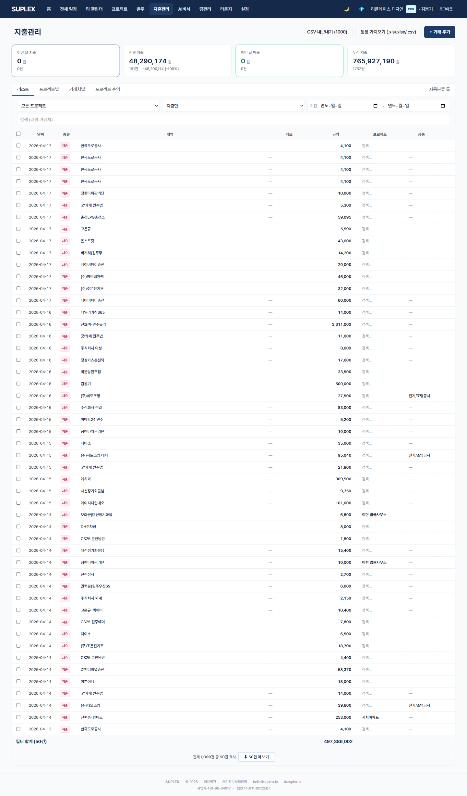
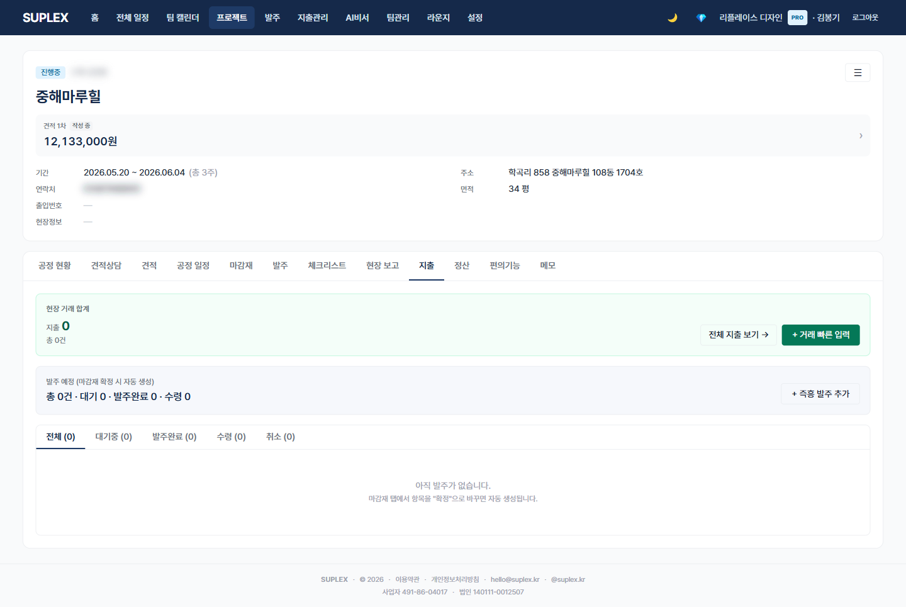
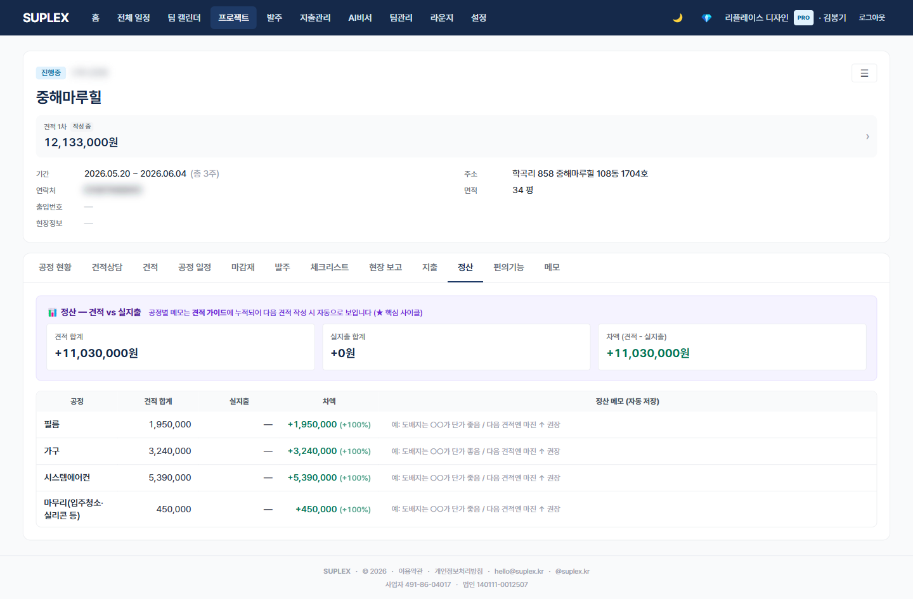

# 챕터 13. 지출 관리 · 정산

> 이 챕터를 읽고 나면 — 회사 전체 지출과 프로젝트별 지출을 분리해 입력하고, 공정별 견적 대비 실지출 차액을 정산 메모로 누적해 다음 견적에 활용할 수 있게 됩니다.

> 정책 노트: 수플렉스의 지출 관리는 **프로젝트별 비용·손익 추적**만 다룹니다. 회계(복식부기·부가세 신고·원천세) 영역은 다루지 않습니다.

---

## 지출의 세 페이지

| 위치 | 단위 | 용도 |
|---|---|---|
| **상위 메뉴 → 지출** | 회사 전체 | 모든 현장 지출 일괄 뷰 + 비프로젝트 일반 지출 |
| **프로젝트 → 지출 탭** | 한 프로젝트 | 발주 + 지출 동시 뷰 |
| **프로젝트 → 정산 탭** | 한 프로젝트 | 공정별 견적 vs 실지출 + 정산 메모 |

---

## 13-1. 전사 지출 페이지

> **이 페이지는** 회사 전체의 지출·매출·이체를 5개 뷰에서 모아 보는 기능을 가지고 있습니다. 좌측 메뉴 **지출** 클릭.

### 화면 한눈에

> 📸 `assets/screens/06_expenses.png` — 영역 ①~⑥ 라벨링 후 저장

| 번호 | 영역 | 설명 |
|---|---|---|
| ① | 페이지 타이틀 + 5 뷰 탭 | 리스트 · 프로젝트별 · 거래처별 · P&L(plan별 가시성) · 자동분류 룰 |
| ② | 필터 바 | 프로젝트 · 타입(EXPENSE/INCOME/TRANSFER) · 기간 · 검색어 |
| ③ | 요약 카드 | 이번달·전월·누적·노프로젝트 합계 |
| ④ | 지출 표 | 날짜 · 거래처 · 항목 · 금액 · 결제수단 · 프로젝트. 인라인 편집 |
| ⑤ | + 인라인 신규 행 | 모달 없이 표 하단에 빈 행 추가, 입력 후 자동저장 |
| ⑥ | CSV 가져오기 | 은행 .xls/.xlsx 직접 파싱 + 자동분류 룰 매칭 + 출구정리 후보 카드 |

### 이 페이지에서 할 수 있는 것

- 지출·매출·이체(통장 단방향 입력) 3 타입 통합 관리
- 5 뷰 전환으로 같은 데이터의 다른 시각 — 리스트·프로젝트별·거래처별·손익·자동분류 룰
- 은행 통장 CSV·xls 직접 업로드 — 한글 인코딩 자동 감지, 헤더 자동 탐지
- 자동분류 룰 (ExpenseCategoryRule) — 키워드 매칭으로 거래처·프로젝트·공정 자동 채움
- 출구정리 추론엔진 — "✨ 후보" 버튼으로 발주 매칭 후보 1-클릭 확인
- 노프로젝트 일반 지출 별도 추적
- 회계사 전달용 CSV 내보내기

### 이럴 때 옵니다 (시나리오)

- **월말 통장 정리** — 은행 거래내역 .xls 다운로드 → CSV 가져오기 → ✨ 후보로 발주 매칭 1-클릭
- **거래처별 미수금·미지급 확인** — 거래처별 뷰
- **외부 회계사 전달** — 리스트 뷰 → 기간 필터 → CSV 내보내기

### 인접 페이지로

- → [프로젝트 지출 탭](#13-2-프로젝트-지출-탭) — 한 현장 발주 + 지출 같이 보기
- → [정산](#13-3-프로젝트-정산-탭) — 공정별 견적 대비 분석
- → [발주](09-orders.md) — 출구정리 후보 카드의 매칭 소스

---

## 13-2. 프로젝트 지출 탭

> **이 페이지는** 한 프로젝트의 발주와 지출을 한 화면에서 동시에 관리하는 기능을 가지고 있습니다. 프로젝트 → **지출** 탭.

### 화면 한눈에

> 📸 `assets/screens/22_project_expenses.png` — 영역 ①~⑤ 라벨링 후 저장

| 번호 | 영역 | 설명 |
|---|---|---|
| ① | 상단 발주 표 | 상태 탭(전체/대기/발주중/수령/취소) + 발주 행 |
| ② | 하단 지출 표 | 인라인 편집 가능, 빠른 추가 행 |
| ③ | 합계 카드 | 매출(INCOME) · 지출(EXPENSE) 누적 |
| ④ | 빠른 추가 | 1줄 인라인으로 즉시 지출 추가 |
| ⑤ | "전체 지출 보기 →" 링크 | 전사 지출 페이지로 projectId 필터 자동 적용해 이동 |

### 이 페이지에서 할 수 있는 것

- 발주와 지출을 한 화면에서 매칭 — 발주 RECEIVED 후 그 자리에서 지출 라벨링
- 빠른 추가로 모달 없이 1줄 지출 입력
- 인라인 편집으로 거래처·금액·결제수단 즉시 수정
- 합계 카드에서 매출·지출 누적 확인 → 마진 직관 파악

### 이럴 때 옵니다 (시나리오)

- **자재 입고·결제 직후** — 발주 행을 RECEIVED로 + 하단 지출 행을 빠른 추가
- **현장 자재비 일괄 정리** — 한 화면에서 발주 ↔ 지출 매칭 확인
- **마진 직관 확인** — 합계 카드의 매출·지출 차이

### 인접 페이지로

- → [정산](#13-3-프로젝트-정산-탭) — 공정별 견적 vs 실지출
- → [발주](09-orders.md) — 발주 단독 작업
- → [전사 지출](#13-1-전사-지출-페이지) — 회사 전체 뷰

---

## 13-3. 프로젝트 정산 탭

> **이 페이지는** 공정별 견적 합계 대비 실지출 합계 차액을 한 표에서 보여주고, 정산 메모를 누적해 다음 견적 작성에 활용하는 기능을 가지고 있습니다. 프로젝트 → **정산** 탭.

### 화면 한눈에

> 📸 `assets/screens/23_project_settlement.png` — 영역 ①~⑤ 라벨링 후 저장

| 번호 | 영역 | 설명 |
|---|---|---|
| ① | 공정별 한 줄 행 | 공정명 · 견적 합계 · 실지출 합계 · 차액(±%) · 메모 input |
| ② | 견적 라인 자동 집계 | 활성 견적(ACCEPTED 우선)의 라인을 공정별로 합산 |
| ③ | 실지출 자동 집계 | 같은 공정의 지출을 합산 (Expense.phase 매칭) |
| ④ | 차액 ±% | 견적 대비 초과/절감 비율, 색상 구분 |
| ⑤ | 메모 input (onBlur 자동저장) | "도배 마진 -8% — 다음엔 평당 단가 +3,000원 권장" 같은 회고 |

### 이 페이지에서 할 수 있는 것

- 공정별 견적 vs 실지출 자동 비교 (별도 입력 X — 데이터 자동 매칭)
- 차액 ±% 색상으로 즉시 인지 (적자/흑자)
- 정산 메모를 공정별 한 줄로 누적 — onBlur 자동저장
- 회사 누적 정산 노트는 견적 가이드 드로어에서 다음 견적 작성 시 펼침 (간편 견적 탭)

### 이럴 때 옵니다 (시나리오)

- **프로젝트 종료 직후** — 정산 탭 한 번 훑고 공정별 회고 메모 1줄씩 입력
- **유사 프로젝트 새 견적 작성** — 견적 가이드 드로어에서 과거 정산 메모 펼쳐 단가 보정
- **마진 적자 공정 추적** — 차액 빨간색 행만 골라 원인 분석 → 다음 견적에 반영

### 인접 페이지로

- → [간편 견적](06-simple-quote.md) — 다음 견적에 정산 메모 자동 prefill
- → [프로젝트 지출](#13-2-프로젝트-지출-탭) — 실지출 입력
- → [공정 현황](13-schedule.md#12-3-공정-현황-탭) — 공정별 4축 통합 뷰

### 자주 묻는 질문

**Q. 정산 메모가 다음 견적에 어떻게 반영되나요?**
A. 견적 가이드 드로어(QuoteGuideDrawer)가 같은 공정의 정산 메모를 모아 보여줍니다. 회사 전체에 걸쳐 누적 → 새 견적 작성 시 공정별로 펼쳐 참조.

**Q. 회계용 부가세 신고는 가능한가요?**
A. 본 화면은 프로젝트별 비용·손익 추적용입니다. 부가세 신고·복식부기는 별도 회계 ERP 영역.

**Q. 출구정리 추론엔진은 어디서 동작하나요?**
A. 전사 지출 페이지의 CSV 가져오기 모달 안에서 "✨ 후보" 버튼으로 작동. 거래처+금액+날짜+현장 점수 기반 발주 매칭 후보를 1-클릭 컨펌.

---

[← 챕터 12](13-schedule.md) · [다음: 챕터 14 — AI 비서 →](15-ai-assistant.md)
