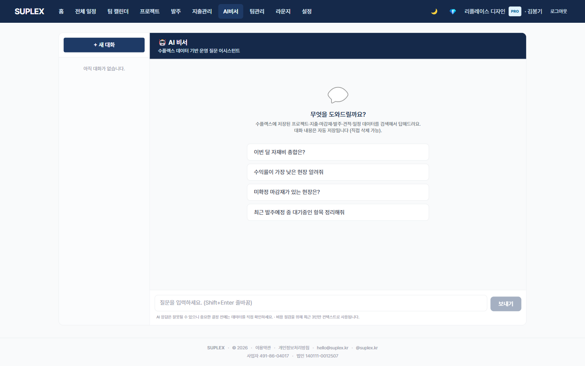

# 챕터 14. AI 비서

> ⚠️ **본 챕터는 v0.7 1차 골격만 작성**. AI 비서는 베타 정책상 제한 활성으로 운영 중이며, 정식 출시 시 구독 등급 차등으로 풀립니다. 사용 흐름·답변 정확도·구독 한도는 정식 출시 직전 보강 예정 (TODO 메모리 1-E 참조).

> 이 챕터를 읽고 나면 — 자연어로 회사 지출·견적·발주 데이터를 질문하고 답변받는 기능의 구조를 이해할 수 있게 됩니다.

---

## AI 비서 페이지

> **이 페이지는** 자연어 질문을 받아 10개 도구로 회사 DB를 조회한 후 카카오톡 스타일 챗으로 답변하는 기능을 가지고 있습니다. 좌측 메뉴 **AI 비서** 클릭.

### 화면 한눈에

> 📸 `assets/screens/07_ai_assistant.png` — 영역 ①~⑤ 라벨링 후 저장



| 번호 | 영역 | 설명 |
|---|---|---|
| ① | 좌측 스레드 사이드바 | 과거 대화 스레드 목록. 클릭 → 그 대화 이어가기. + 새 대화 |
| ② | 챗 영역 | 사용자 우측 navy 말풍선 / AI 좌측 white. SSE 스트리밍 |
| ③ | 도구 호출 칩 | 답변 생성 중 호출한 도구를 칩으로 표시 (예: 🔍 프로젝트 검색 · 🧮 지출 합계) |
| ④ | 추천 질문 4개 | 첫 화면에서 자주 묻는 패턴 자동 노출 |
| ⑤ | 질문 input | 하단 입력창. Enter → 전송 |

### 사용 가능한 10개 도구

| 도구 | 무엇을 |
|---|---|
| 🔍 search_projects | 프로젝트 이름·고객·주소로 검색 |
| 📊 get_project_summary | 한 프로젝트의 종합 상태 |
| 📅 list_schedules | 공정 일정 조회 |
| ✅ list_checklists | 체크리스트 조회 |
| 💸 list_expenses | 지출 목록 |
| 🧮 sum_expenses | 지출 합계 (그룹·기간) |
| 🪵 list_materials | 마감재 조회 |
| 📦 list_purchase_orders | 발주 조회 |
| 📄 list_quotes | 견적 조회 |
| 💰 get_pnl_summary | 전체 손익 |

도구는 모두 **read-only**이며 companyId 강제 필터로 다른 회사 데이터에 접근 불가.

### 이 페이지에서 할 수 있는 것

- 자연어 질문 → SSE 스트리밍 답변
- 좌측 스레드 사이드바에서 과거 대화 영구 보관 (DB 무한 보존)
- 추천 질문 4개 클릭으로 첫 사용 진입 장벽 낮춤
- 도구 호출 과정을 칩으로 투명 표시

### 추천 질문 예시

```
"이번 달 자재비 총합은?"
"수익률이 가장 낮은 현장 알려줘"
"미확정 마감재가 있는 현장은?"
"최근 발주예정 중 대기중인 항목 정리해줘"
```

### 데이터 보안

- 모든 도구는 companyId 필터 강제 — 다른 회사 데이터 접근 불가
- 회계 도구는 OWNER 한정 (DESIGNER/FIELD는 회계 관련 도구 미노출)
- Claude API 호출 시 최근 3턴만 컨텍스트로 전송 (토큰 비용 절감)

### 인접 페이지로

- → [지출 관리](14-expenses.md) — AI 답변 결과를 직접 확인·수정
- → [공정 현황](13-schedule.md#12-3-공정-현황-탭) — 시각적 4축 뷰
- → [홈](03-home.md) — 결정론적 "3일 안에 할 일" 카드

### 자주 묻는 질문

**Q. AI가 잘못 답하면 어떻게 하나요?**
A. 답변은 항상 도구 호출 결과(read-only 쿼리)를 기반으로 생성됩니다. 의심되면 칩에 표시된 도구를 직접 호출(예: 지출 페이지)해 검증.

**Q. 회사 데이터가 외부로 나가나요?**
A. Claude API에 자연어 질문 + 도구 결과가 전송됩니다. 민감 정보(클라이언트 실명·금액)는 도구 결과에 포함될 수 있으므로, API 사용 정책을 사전 확인 후 사용 권장.

**Q. 대화 기록은 영구 보관되나요?**
A. AiChatThread/Message로 무한 보존. 슈퍼어드민 외에는 회사 내부에서 본인 스레드만 열람.

---

[← 챕터 13](14-expenses.md) · [다음: 챕터 15 — 팀 관리 →](16-teams.md)
