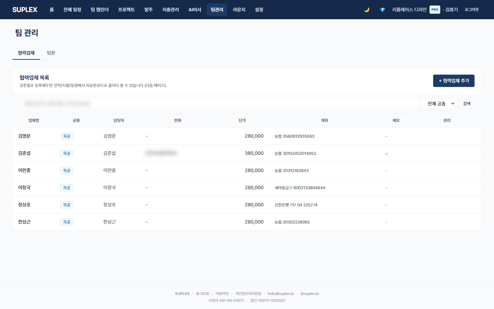

# 챕터 15. 팀 관리

> 이 챕터를 읽고 나면 — 팀원과 협력업체를 한 페이지의 두 서브탭에서 분리 관리하고, 역할별 권한을 부여하며, 초대 토큰으로 신규 멤버를 합류시킬 수 있게 됩니다.

---

## 팀 관리 페이지

> **이 페이지는** 회사 팀원과 협력업체(Vendor)를 두 서브탭으로 분리 관리하는 기능을 가지고 있습니다. 좌측 메뉴 **팀** 클릭.

### 화면 한눈에

> 📸 `assets/screens/08_team.png` — 영역 ①~⑤ 라벨링 후 저장

| 번호 | 영역 | 설명 |
|---|---|---|
| ① | 페이지 타이틀 + 2 서브탭 | 협력업체 · 팀원 (디폴트는 협력업체) |
| ② | 팀원 표 | 이름·이메일·역할(OWNER/DESIGNER/FIELD/LEAD)·가입 시각·임시비번 발급 액션 |
| ③ | 협력업체 표 | 거래처명·종류·연락처·계좌·일당(unitPrice)·식비/교통비 디폴트 |
| ④ | + 초대·추가 액션 | 팀원 → 초대 토큰 발행 / 협력업체 → 즉시 추가 |
| ⑤ | 역할별 토글 | LEAD 지정·역할별 기능 토글(TOGGLEABLE_FEATURES) |

### 두 종류의 차이

| 종류 | 정의 | Suplex 접근 |
|---|---|---|
| **팀원** | 회사 직원 (User + Membership) | 가능. 역할별 권한 |
| **협력업체** (Vendor) | 발주·일정 대상 거래처·작업자 | **불가**. 회사 직원이 관리하는 마스터 데이터 |

협력업체는 Vendor 한 row = 개인 한 명 패턴 (메모리 결정, 2026-04-29). 인건비 정산에 그대로 재사용.

### 이 페이지에서 할 수 있는 것

#### 팀원 서브탭
- 초대 토큰 발행 → 링크 공유로 신규 멤버 합류 (이메일 발송은 정식 출시 시)
- 역할 변경 (OWNER/DESIGNER/FIELD)
- LEAD 지정 (프로젝트 관리 권한 부여)
- 본인 비번 변경은 설정 페이지에서, 다른 팀원 비번 초기화는 OWNER 전용
- 강제 로그아웃 (tokenVersion 증가)
- 본인·마지막 OWNER 보호 (삭제 차단)

#### 협력업체 서브탭
- 거래처·작업자 마스터 입력 — 거래처명·종류·연락처·계좌·일당·식비/교통비 디폴트
- 종류(category) = 공종 (목공·도배·전기…) → 인건비 정산 모달에서 공종 칩으로 노출
- Vendor.unitPrice·defaultMeal·defaultTransport는 인건비 정산 모달에서만 입력·갱신
- 발주·일정·지출 입력 시 자동완성 소스

### 역할별 권한 요약

| 역할 | 권한 |
|---|---|
| **OWNER** | 모든 기능. 팀원 초대·역할 변경·회사 설정·결제 관리. 회사당 최소 1명 필수 |
| **LEAD** | 프로젝트 멤버 관리·일부 OWNER 권한 위임 |
| **DESIGNER** | 프로젝트·견적·마감재·발주 작성. 회사 설정 변경 X |
| **FIELD** | 현장보고·체크리스트·마감재·일정 조회. 견적·지출 X |

### 이럴 때 옵니다 (시나리오)

- **신규 디자이너 합류** — 팀원 탭 → 초대 토큰 발행 → 카톡으로 링크 공유 → 디자이너가 가입·합류
- **하청 시공팀 정보 등록** — 협력업체 탭 → 공종별 작업자 한 명씩 row 추가 (이름·계좌·일당)
- **OWNER 이양** — 다른 팀원에게 OWNER 역할 부여 → 본인은 DESIGNER로 변경 → 안전 시 본인 삭제
- **퇴사자 계정 비활성화** — tokenVersion 증가로 즉시 강제 로그아웃 + 삭제

### 인접 페이지로

- → [편의기능 → 인건비 정산](19-utilities.md#카드-2--인건비-정산) — Vendor 마스터를 직접 사용
- → [발주](09-orders.md) — Vendor를 거래처로 자동완성
- → [공정 일정](13-schedule.md#12-2-프로젝트-공정-일정-탭) — Vendor를 일정 담당으로

### 자주 묻는 질문

**Q. 초대 토큰은 어떻게 전달하나요?**
A. 발행 시 클립보드에 복사됩니다. 카톡·이메일로 직접 전달. 정식 출시 시 자동 이메일 발송 도입(Resend) — 베타 후 6-A 단계.

**Q. OWNER 본인이 비번을 잊었습니다.**
A. 본인 해결 불가. 수플렉스 운영팀(hello@suplex.kr)으로 문의.

**Q. 한 사람이 여러 공종 작업자인 경우는?**
A. 현재 Vendor.category는 단일 공종. 한 사람이 여러 공종이면 Vendor row 2개로 등록 (메모리 결정, 정식 출시 시 다중 공종 검토).

**Q. 다중 회사 소속 직원은?**
A. 한 User가 여러 Membership을 가질 수 있습니다. Layout 헤더 회사 전환 드롭다운(memberships ≥ 2일 때)으로 전환.

---

[← 챕터 14](15-ai-assistant.md) · [다음: 챕터 16 — 설정 →](17-settings.md)
