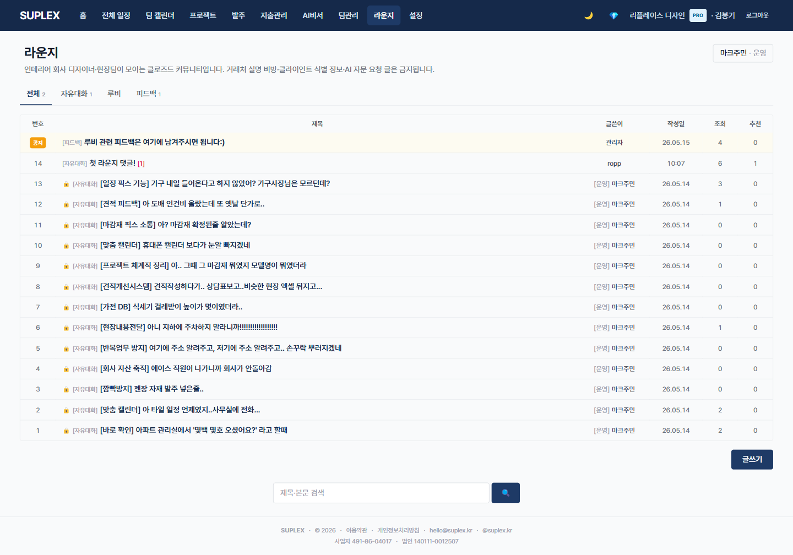
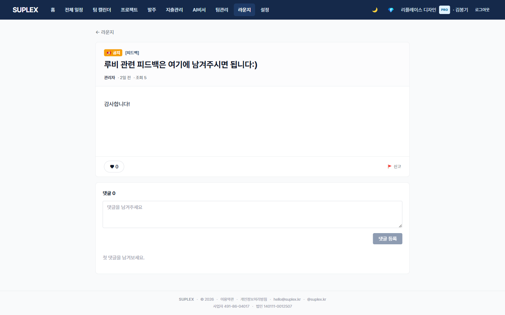
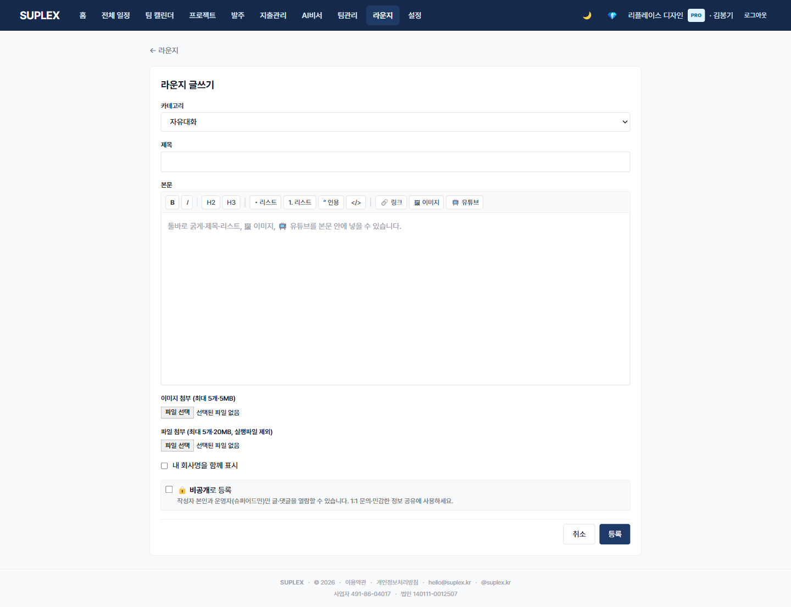

# 챕터 18. 라운지

> 이 챕터를 읽고 나면 — 3개 카테고리에 글을 올리고, 다른 인테리어 업체·시공팀의 글을 읽고 댓글로 참여할 수 있게 됩니다.

> 정책 노트: 라운지는 베타 진입 통제(approvalStatus)를 우회합니다. 미승인 회사도 자유롭게 접근·활동 가능. 퇴사자도 평생 멤버십 유지.

---

## 라운지의 세 페이지

| 위치 | 단위 | 용도 |
|---|---|---|
| **목록** `/lounge` | 회사 전체 회원 | 카테고리·검색·핫포스트 탐색 |
| **게시글** `/lounge/:id` | 한 글 | 본문·댓글·반응 |
| **글쓰기** `/lounge/new` | 작성·수정 | TipTap 위지윅 + 이미지 + .rb 첨부 |

---

## 18-1. 라운지 목록

> **이 페이지는** 3 카테고리·검색·태그로 라운지 글을 탐색하는 기능을 가지고 있습니다. 좌측 메뉴 **라운지** 클릭.

### 화면 한눈에

> 📸 `assets/screens/09_lounge.png` — 영역 ①~⑥ 라벨링 후 저장

| 번호 | 영역 | 설명 |
|---|---|---|
| ① | 페이지 타이틀 + 본인 프로필 | 닉네임·직책(디자이너/현장팀/운영/기타). 닉네임 미설정 시 강제 입력 |
| ② | 카테고리 탭 | 자유 / 스케치업 루비 / 요청 (현재 3개로 축소, 2026-05-14) |
| ③ | 검색 input | 제목·본문 전체 텍스트 검색 |
| ④ | 시스템 공지 | 슈퍼어드민이 핀 고정한 공지, 모든 카테고리 상단 |
| ⑤ | 글 카드 리스트 | 제목·작성자 닉네임·직책 칩·조회수·댓글 수·반응 수·작성 시각 |
| ⑥ | + 새 글 쓰기 버튼 | `/lounge/new` 진입 |

### 이 페이지에서 할 수 있는 것

- 3 카테고리(자유·스케치업 루비·요청) 전환
- 제목·본문 통합 검색
- 본인 프로필 닉네임·직책 변경
- 핫포스트(반응 많은 글) 자동 노출
- 카드 클릭 → 게시글 페이지
- 시스템 공지는 카테고리 상단 핀 고정

### 카테고리 정의

| 카테고리 | 용도 |
|---|---|
| **자유** (free) | 단가·시공 노하우·업계 동향 등 자유 주제 |
| **스케치업 루비** (ruby) | 스케치업 단축키·루비 플러그인·노하우. .rb 파일 첨부(3개·1MB 한도) |
| **요청** (request) | 시공팀·디자이너·도배사 등 단발성 협업 구인 |

### 이럴 때 옵니다 (시나리오)

- **새 단가 책정 전** — 자유 카테고리에서 동종 업체 평당 단가 참고
- **스케치업 루비 파일 받기** — 루비 카테고리 첨부 다운로드
- **시공팀 단발성 구인** — 요청 카테고리에 게시
- **다른 업체 분쟁 사례** — 자유 카테고리 검색

### 인접 페이지로

- → [게시글 보기](#18-2-라운지-게시글) — 카드 클릭
- → [글쓰기](#18-3-라운지-글쓰기) — + 새 글 쓰기

---

## 18-2. 라운지 게시글

> **이 페이지는** 한 글의 본문·첨부·댓글·반응을 보고 본인 글이면 수정·삭제하는 기능을 가지고 있습니다.

### 화면 한눈에

> 📸 `assets/screens/10_lounge_post.png` — 영역 ①~⑤ 라벨링 후 저장

| 번호 | 영역 | 설명 |
|---|---|---|
| ① | 글 헤더 | 제목·카테고리·작성자 닉네임/직책·작성·수정 시각·조회수 |
| ② | 본문 | TipTap 위지윅 렌더링 (이미지 인라인, 마크다운 호환) |
| ③ | 첨부 영역 | 이미지(라이트박스) + .rb 파일 다운로드 버튼 |
| ④ | 반응 + 댓글 | ❤️ 반응 토글, 댓글 작성·답글 |
| ⑤ | 액션 (본인 글) | 수정 · 삭제 · 비공개 토글 (본인+슈퍼어드민만 비공개 글 열람) |

### 이 페이지에서 할 수 있는 것

- 본문·이미지·첨부 다운로드
- ❤️ 반응 토글 (반응 수 캐시 자동 갱신)
- 댓글·답글 작성
- 본인 글이면 수정·삭제·비공개 토글
- showCompanyName 토글로 회사명 노출 여부 결정
- 슈퍼어드민이 핀 고정한 글은 상단 안내

### 이럴 때 옵니다 (시나리오)

- **첨부 .rb 다운로드** — 루비 카테고리에서 검색해 받은 글
- **본인 글 수정** — 단가 변경 등 정보 갱신
- **다른 사용자 답글** — 단가 질문에 직책별 답변 받기

### 인접 페이지로

- → [목록](#18-1-라운지-목록)으로
- → [글쓰기](#18-3-라운지-글쓰기) (본인 글 수정도 같은 페이지)

---

## 18-3. 라운지 글쓰기

> **이 페이지는** TipTap 위지윅 에디터로 글을 작성·편집하는 기능을 가지고 있습니다. `/lounge/new` 또는 본인 글 수정.

### 화면 한눈에

> 📸 `assets/screens/11_lounge_new.png` — 영역 ①~⑤ 라벨링 후 저장

| 번호 | 영역 | 설명 |
|---|---|---|
| ① | 카테고리 셀렉트 | 자유 / 루비 / 요청 |
| ② | 제목 input | |
| ③ | 본문 에디터 | TipTap 위지윅 (볼드·이탤릭·리스트·코드·이미지) |
| ④ | 첨부 영역 | 이미지 + .rb (.rb는 루비 카테고리 3개·1MB 한도) |
| ⑤ | 옵션 | 회사명 노출 토글 · 비공개 토글 · 작성 / 취소 |

### 이 페이지에서 할 수 있는 것

- TipTap 에디터로 마크다운·위지윅 입력
- 이미지 드래그·드롭 또는 클릭 업로드 (Cloudinary)
- 루비 파일 첨부 (.rb, 카테고리=루비일 때만)
- 회사명 노출 여부 토글
- 비공개 글 토글 (본인 + 슈퍼어드민만 열람)

### 자주 묻는 질문

**Q. 라운지에 글을 쓰면 회사 다른 멤버가 볼 수 있나요?**
A. 회사 단위가 아닌 **수플렉스 전체 라운지 회원**이 모두 봅니다. 회사 외부에 노출되니 민감 정보는 작성하지 마세요.

**Q. 회사명을 가리고 글을 쓸 수 있나요?**
A. ⑤ "회사명 노출 토글"을 끄면 닉네임만 표시됩니다.

**Q. 퇴사하면 라운지 글이 사라지나요?**
A. 사라지지 않습니다. 라운지는 평생 멤버십. 본인 글은 본인 계정으로 계속 관리.

**Q. 비공개 글은 어디서 보나요?**
A. 작성자 본인 + 슈퍼어드민만 열람. 목록에는 본인에게만 표시.

---

[← 챕터 17](17-settings.md) · [다음: 챕터 19 — 편의기능 →](19-utilities.md)
