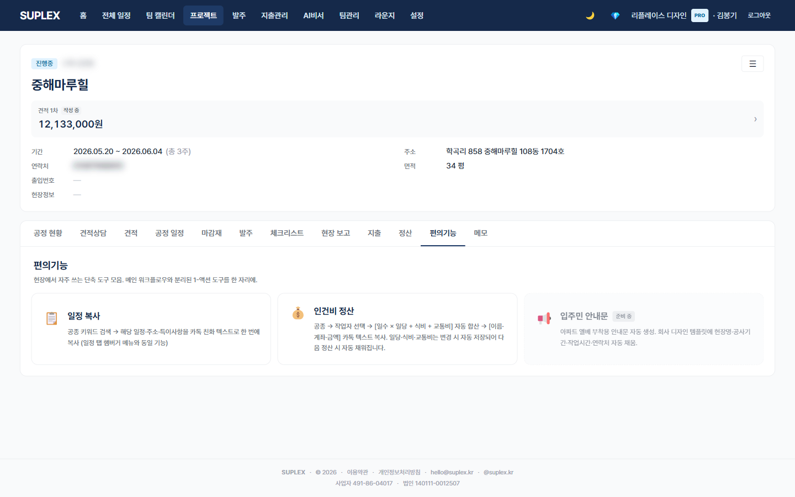

# 챕터 19. 편의기능 (프로젝트)

> 이 챕터를 읽고 나면 — 일정 복사·인건비 정산을 한 자리에서 1-액션으로 처리하고, 결과를 카톡으로 즉시 전달할 수 있게 됩니다.

---

## 편의기능 탭

> **이 페이지는** 메인 워크플로우 탭(견적·공정 일정·마감재·발주)과 분리된 1-액션 단축 도구를 카드 그리드로 제공하는 기능을 가지고 있습니다. 프로젝트 → **편의기능** 탭 (지출과 메모 사이).

### 화면 한눈에

> 📸 `assets/screens/24_project_tools.png` — 영역 ①~③ 라벨링 후 저장



| 번호 | 영역 | 설명 |
|---|---|---|
| ① | 카드 그리드 | 1~3열 반응형. 각 카드는 1-액션 도구 진입점 |
| ② | 준비 중 카드 | 점선 테두리 + "준비 중" 뱃지. 클릭 비활성 |
| ③ | 모달 진입 | 카드 클릭 → 전용 모달 열림 (일정 복사 모달 / 인건비 정산 모달) |

---

## 카드 1 — 일정 복사

> **이 도구는** 공종 키워드 검색으로 일정·주소·특이사항을 카톡 친화 텍스트로 한 번에 복사하는 기능을 가지고 있습니다. (일정 탭 햄버거 메뉴와 동일 기능 — 이중 진입점)

### 사용 흐름

1. 카드 클릭 → 일정 복사 모달
2. 공종 키워드 입력 (예: "타일")
3. 기간 선택 (시작일·종료일)
4. **복사** → 클립보드에 텍스트 + 회사 푸터
5. 카톡 채널에 붙여넣기

### 텍스트 예시

```
[강남 래미안 304호] 타일 공정 일정
───────────────────
5/20 (수)  욕실 벽·바닥 타일
5/21 (목)  욕실 줄눈 작업
5/22 (금)  주방 타일

주소: 서울 강남구 테헤란로 123
출입: 인터폰 *1234

📋 인테리어 회사 협업 캘린더 · suplex.kr
```

---

## 카드 2 — 인건비 정산

> **이 도구는** Vendor 마스터에서 작업자를 선택해 일수·일당·식비·교통비를 자동 합산하고, [이름·계좌·금액] 카톡 텍스트를 복사하면서 메모 탭에 "인건비" 태그로 자동 기록하는 기능을 가지고 있습니다.

### 사용 흐름

1. 카드 클릭 → 인건비 정산 모달
2. **공종 칩 선택** (목공·도배·전기 등 Vendor.category)
3. **작업자 다중 선택** — 해당 공종의 Vendor 목록에서
4. 행마다 **일수 · 일당 · 식비 · 교통비** 입력 (Vendor 디폴트값 자동 채움)
5. 합계 자동 계산 + 카톡 미리보기 실시간
6. **📋 카톡 복사 + 저장** → 클립보드 복사 + Vendor 디폴트값 자동 갱신 + 메모 탭 "인건비" 태그로 자동 기록

### 텍스트 예시

```
[강남 래미안 304호] 4월 정산
───────────────────
김OO 목수 (5일)
  국민 123-45-678901
  650,000원

이OO 도배 (3일)
  하나 234-56-789012
  390,000원
───────────────────
합계 1,040,000원

📋 인테리어 회사 협업 캘린더 · suplex.kr
```

### 저장 정책

- **일당** = `Vendor.unitPrice` 활용. 변경 시 자동 갱신
- **식비·교통비** = `Vendor.defaultMeal` · `Vendor.defaultTransport`. 정산 모달에서만 입력 (협력업체 탭에는 노출 X)
- 변경된 행만 PATCH (idempotent + 부하 최소)
- **지출 탭으로의 자동 push 없음** — 지출 격리 정책 유지
- **정산 기록 출구 = 메모 탭** — 별도 PaymentSettlement 모델 없음

### 이럴 때 옵니다 (시나리오)

- **월말 작업자 정산** — 공종별 작업자 묶음 입력 → 카톡 → 송금 후 메모 자동 기록으로 이력 확인
- **단일 작업자 일당 변경** — 모달에서 일당 수정 → 카톡 복사 시 Vendor 디폴트 자동 갱신 → 다음 정산에서 자동 반영
- **인수인계** — 다음 담당자가 메모 "인건비" 태그 필터로 정산 이력 한눈에 확인

---

## 카드 3 — 입주민 안내문 (준비 중)

> **이 도구는** 아파트 엘리베이터 부착용 안내문을 회사 디자인 템플릿에 변수 자동 채움으로 생성하는 기능을 제공할 예정입니다. 현재 점선 카드 placeholder.

### 자동 채움 예정 변수

- 현장명 · 단지/세대
- 공사 기간 (공정 일정의 첫·마지막 일자)
- 작업 시간 (회사 디폴트)
- 시공사 · 연락처
- 양해 문구

회사가 사용 중인 디자인 템플릿(PNG/PSD/Figma)에 위 변수만 자동 채움. 공정 일정 첫 공정 D-3 어드바이스에 "엘베 안내문 출력" 자동 체크 항목 추가 병행 검토 중.

---

## 인접 페이지로

- → [공정 일정](13-schedule.md#12-2-프로젝트-공정-일정-탭) — 일정 입력
- → [메모](12-memo.md) — 인건비 정산 자동 기록 출구
- → [팀 관리](16-teams.md) — Vendor 마스터(협력업체) 입력
- → [지출 관리](14-expenses.md) — 정산과 별도, 지출 격리 정책

## 자주 묻는 질문

**Q. 인건비 정산을 했는데 지출 탭에 안 나타나요. 누락 아닌가요?**
A. 의도된 동작입니다. 지출 격리 정책상 다른 모듈에서 지출 탭으로 자동 push되지 않습니다. 정산 기록은 메모 탭 "인건비" 태그에서 확인.

**Q. Vendor 디폴트값을 협력업체 탭에서도 보고 싶습니다.**
A. 사용자 결정상 현재는 정산 모달에서만 입력·확인. 협력업체 탭에는 노출 X. 정식 출시 시 재검토.

**Q. 일정 복사를 일정 탭 햄버거 메뉴와 편의기능 탭 두 곳에 둔 이유는?**
A. 일정 탭은 워크플로우 진행 중 자연스러운 진입점, 편의기능 탭은 도구 발견용 진입점. 이중 진입점으로 학습 비용 감소.

---

[← 챕터 13](14-expenses.md) · [다음: 챕터 14 — AI 비서 →](15-ai-assistant.md)
